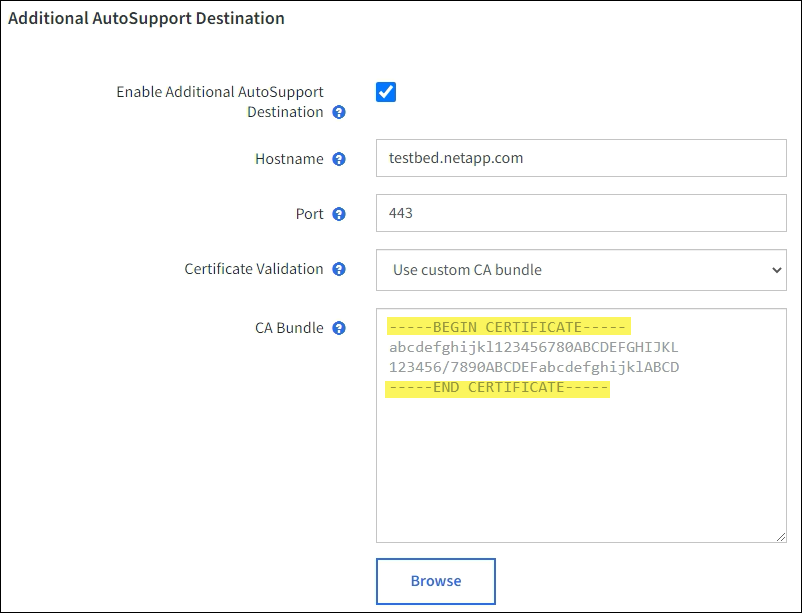

= AutoSupport를 구성합니다
:allow-uri-read: 
:icons: font
:imagesdir: ../media/

[role="lead"]
StorageGRID를 처음 설치할 때 AutoSupport 기능 및 개별 AutoSupport 옵션을 활성화하거나 나중에 활성화할 수 있습니다.

.시작하기 전에
* 를 사용하여 그리드 관리자에 로그인했습니다 link:../admin/web-browser-requirements.html["지원되는 웹 브라우저"].
* 루트 액세스 또는 기타 그리드 구성 권한이 있습니다.
* AutoSupport 메시지를 보내는 데 HTTPS를 사용할 경우, 직접 또는 에서 기본 관리자 노드에 대한 아웃바운드 인터넷 액세스를 제공했습니다 link:configuring-admin-proxy-settings.html["프록시 서버 사용"] (인바운드 연결은 필요하지 않음).
* StorageGRID AutoSupport 페이지에서 HTTP를 선택한 경우 AutoSupport 메시지를 HTTPS로 전달하도록 프록시 서버를 구성했습니다. NetApp의 AutoSupport 서버는 HTTP를 사용하여 전송되는 메시지를 거부합니다.
* AutoSupport 메시지의 프로토콜로 SMTP를 사용할 경우 SMTP 메일 서버를 구성했습니다. 알람 이메일 알림(레거시 시스템)에 동일한 메일 서버 구성이 사용됩니다.

== AutoSupport 메시지의 프로토콜을 지정합니다

다음 프로토콜을 사용하여 AutoSupport 메시지를 보낼 수 있습니다.

* * HTTPS *: 새 설치에 대한 기본 권장 설정입니다. 이 프로토콜은 포트 443을 사용합니다. 원하는 경우 <<AutoSupport 온디맨드 를 활성화합니다,AutoSupport 온디맨드 기능을 활성화합니다>>HTTPS를 사용해야 합니다.
* * HTTP *: HTTP를 선택한 경우 AutoSupport 메시지를 HTTPS로 전달하도록 프록시 서버를 구성해야 합니다. NetApp의 AutoSupport 서버는 HTTP를 사용하여 전송되는 메시지를 거부합니다. 이 프로토콜은 포트 80을 사용합니다.
* * SMTP *: AutoSupport 메시지를 이메일로 보내려면 이 옵션을 사용합니다. AutoSupport 메시지의 프로토콜로 SMTP를 사용하는 경우 레거시 전자 메일 설정 페이지(* 지원*>* 알람(레거시)*>* 레거시 전자 메일 설정*)에서 SMTP 메일 서버를 구성해야 합니다.
+

NOTE: SMTP는 StorageGRID 11.2 릴리스 이전에 AutoSupport 메시지에 사용할 수 있는 유일한 프로토콜이었습니다. 처음에 이전 버전의 StorageGRID를 설치한 경우 SMTP가 선택된 프로토콜일 수 있습니다.

설정한 프로토콜은 모든 유형의 AutoSupport 메시지를 전송하는 데 사용됩니다.

.단계
. 지원 * > * 도구 * > * AutoSupport * 를 선택합니다.
+
AutoSupport 페이지가 나타나고 * 설정 * 탭이 선택됩니다.

+
image::../media/autosupport_settings_tab.png[설정 탭이 있는 AutoSupport 페이지 selected.png]

. AutoSupport 메시지를 보내는 데 사용할 프로토콜을 선택합니다.
. HTTPS * 를 선택한 경우 TLS 인증서를 사용하여 NetApp 지원 서버에 대한 연결을 보호할지 여부를 선택합니다.
+
** * NetApp 지원 인증서 사용 * (기본값): 인증서 검증으로 AutoSupport 메시지를 안전하게 전송할 수 있습니다. NetApp 지원 인증서는 StorageGRID 소프트웨어와 함께 이미 설치되어 있습니다.
** 인증서 확인 안 함 *: 인증서에 일시적인 문제가 있는 경우와 같이 인증서 유효성 검사를 사용하지 않는 것이 좋은 경우에만 이 옵션을 선택합니다.

. 저장 * 을 선택합니다.
+
매주, 사용자 트리거 및 이벤트 트리거 메시지는 선택한 프로토콜을 사용하여 전송됩니다.

== 주간 AutoSupport 메시지를 비활성화합니다

기본적으로 StorageGRID 시스템은 AutoSupport 메시지를 일주일에 한 번 NetApp Support에 보내도록 구성됩니다.

Weekly AutoSupport 메시지가 언제 전송되는지 확인하려면 * AutoSupport * > * Results * 탭으로 이동하십시오. Weekly AutoSupport * 섹션에서 * Next Scheduled Time * 값을 확인합니다.

image::../media/autosupport_weekly_next_scheduled_time.png[Weekly AutoSupport next scheduled time.(다음]

매주 AutoSupport 메시지를 자동으로 전송하지 않도록 설정할 수 있습니다.

.단계
. 지원 * > * 도구 * > * AutoSupport * 를 선택합니다.
. Weekly AutoSupport * 활성화 확인란의 선택을 취소합니다.
. 저장 * 을 선택합니다.

== 이벤트 트리거 AutoSupport 메시지를 비활성화합니다

기본적으로 StorageGRID 시스템은 중요한 알림 또는 기타 중요한 시스템 이벤트가 발생할 경우 NetApp 지원에 AutoSupport 메시지를 보내도록 구성됩니다.

언제든지 이벤트 트리거 AutoSupport 메시지를 사용하지 않도록 설정할 수 있습니다.

.단계
. 지원 * > * 도구 * > * AutoSupport * 를 선택합니다.
. 이벤트 트리거 AutoSupport* 활성화 확인란의 선택을 취소합니다.
. 저장 * 을 선택합니다.

== AutoSupport 온디맨드 를 활성화합니다

AutoSupport On Demand는 기술 지원이 활발하게 진행 중인 문제를 해결하는 데 도움이 될 수 있습니다.

기본적으로 AutoSupport On Demand는 비활성화되어 있습니다. 이 기능을 활성화하면 기술 지원 부서에서 StorageGRID 시스템에 AutoSupport 메시지가 자동으로 전송되도록 요청할 수 있습니다. 기술 지원 부서에서는 AutoSupport 주문형 쿼리에 대한 폴링 시간 간격을 설정할 수도 있습니다.

기술 지원 부서에서 AutoSupport On Demand를 활성화하거나 비활성화할 수 없습니다.

.단계
. 지원 * > * 도구 * > * AutoSupport * 를 선택합니다.
. 프로토콜에 대해 * HTTPS * 를 선택합니다.
. Weekly AutoSupport * 활성화 확인란을 선택합니다.
. AutoSupport On Demand * 확인란을 선택합니다.
. 저장 * 을 선택합니다.
+
AutoSupport On Demand가 활성화되어 있으면 기술 지원 부서에서 AutoSupport On Demand 요청을 StorageGRID로 보낼 수 있습니다.

== 소프트웨어 업데이트 확인을 비활성화합니다

기본적으로 StorageGRID은 NetApp에 문의하여 사용 가능한 소프트웨어 업데이트가 있는지 확인합니다. StorageGRID 핫픽스 또는 새 버전을 사용할 수 있는 경우 새 버전이 StorageGRID 업그레이드 페이지에 표시됩니다.

필요에 따라 소프트웨어 업데이트 확인을 비활성화할 수도 있습니다. 예를 들어 시스템에 WAN 액세스가 없는 경우 다운로드 오류를 방지하려면 검사를 비활성화해야 합니다.

.단계
. 지원 * > * 도구 * > * AutoSupport * 를 선택합니다.
. 소프트웨어 업데이트 확인 * 확인란의 선택을 취소합니다.
. 저장 * 을 선택합니다.

== AutoSupport 대상을 추가합니다

AutoSupport를 활성화하면 상태 및 상태 메시지가 NetApp 지원으로 전송됩니다. 모든 AutoSupport 메시지에 대해 하나의 추가 대상을 지정할 수 있습니다.

AutoSupport 메시지를 보내는 데 사용되는 프로토콜을 확인하거나 변경하려면 에 대한 지침을 참조하십시오 <<AutoSupport 메시지의 프로토콜을 지정합니다>>.

NOTE: SMTP 프로토콜을 사용하여 AutoSupport 메시지를 추가 대상으로 보낼 수 없습니다.

.단계
. 지원 * > * 도구 * > * AutoSupport * 를 선택합니다.
. AutoSupport 대상 추가 활성화 * 를 선택합니다.
. 다음을 지정합니다.
+
[cols="1a,2a"]
|===
| 필드에 입력합니다 | 설명 

 a| 
호스트 이름
 a| 
추가 AutoSupport 대상 서버의 서버 호스트 이름 또는 IP 주소입니다.

* 참고 *: 하나의 추가 대상만 입력할 수 있습니다.

 a| 
포트
 a| 
추가 AutoSupport 대상 서버에 연결하는 데 사용되는 포트입니다. 기본값은 HTTP의 경우 포트 80, HTTPS의 경우 포트 443입니다.

 a| 
인증 검증
 a| 
TLS 인증서를 사용하여 추가 대상에 대한 연결을 보호할지 여부를 나타냅니다.

** 인증서 확인 없이 AutoSupport 메시지를 보내려면 * 인증서 확인 안 함 * 을 선택합니다.
+
인증서에 일시적인 문제가 있는 경우와 같이 인증서 유효성 검사를 사용하지 않는 좋은 이유가 있는 경우에만 이 옵션을 선택합니다.

** 인증서 유효성 검사를 사용하려면 사용자 지정 CA 번들 사용 * 을 선택합니다.

|===
. 사용자 지정 CA 번들 * 사용 을 선택한 경우 다음 중 하나를 수행합니다.
+
** 찾아보기 * 를 선택하고 인증서가 포함된 파일을 찾은 다음 * 열기 * 를 선택하여 파일을 업로드합니다.
** 편집 도구를 사용하여 인증서 체인 순서대로 연결된 * CA 번들 * 필드에 PEM 인코딩된 각 CA 인증서 파일의 모든 내용을 복사하여 붙여 넣습니다.
+
반드시 포함해야 합니다 `----BEGIN CERTIFICATE----` 및 `----END CERTIFICATE----` 선택합니다.

+

. 저장 * 을 선택합니다.
+
향후 모든 주별, 이벤트 트리거 및 사용자 트리거 AutoSupport 메시지가 추가 대상으로 전송됩니다.

