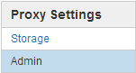

= 관리자 프록시 설정을 구성합니다
:allow-uri-read: 
:icons: font
:imagesdir: ../media/

[role="lead"]
HTTP 또는 HTTPS를 사용하여 AutoSupport 메시지를 보내는 경우( 참조 link:configure-autosupport-grid-manager.html["AutoSupport를 구성합니다"])에서 관리자 노드와 기술 지원(AutoSupport) 간에 투명하지 않은 프록시 서버를 구성할 수 있습니다.

.시작하기 전에
* 특정 액세스 권한이 있습니다.
* 를 사용하여 그리드 관리자에 로그인했습니다 link:../admin/web-browser-requirements.html["지원되는 웹 브라우저"].

.이 작업에 대해
단일 관리 프록시에 대한 설정을 구성할 수 있습니다.

.단계
. 구성 * > * 보안 * > * 프록시 설정 * 을 선택합니다.
+
관리자 프록시 설정 페이지가 나타납니다. 기본적으로 보조 아이콘 메뉴에서 * 스토리지 * 가 선택됩니다.

. 측면 표시줄 메뉴에서 * Admin * 을 선택합니다.
+

. 관리자 프록시 사용 * 확인란을 선택합니다.
+
image::../media/proxy_settings_admin.png[관리자 프록시 설정 대화 상자의 스크린샷]

. 프록시 서버의 호스트 이름 또는 IP 주소를 입력합니다.
. 프록시 서버에 연결하는 데 사용되는 포트를 입력합니다.
. 필요에 따라 프록시 사용자 이름을 입력합니다.
+
프록시 서버에 사용자 이름이 필요하지 않은 경우 이 필드를 비워 둡니다.

. 필요에 따라 프록시 암호를 입력합니다.
+
프록시 서버에 암호가 필요하지 않은 경우 이 필드를 비워 둡니다.

. 저장 * 을 선택합니다.
+
관리자 프록시가 저장되면 관리 노드와 기술 지원 사이의 프록시 서버가 구성됩니다.

+

NOTE: 프록시 변경 사항이 적용되려면 최대 10분이 소요될 수 있습니다.

. 프록시를 비활성화해야 하는 경우 * 관리자 프록시 사용 * 확인란의 선택을 취소하고 * 저장 * 을 선택합니다.

