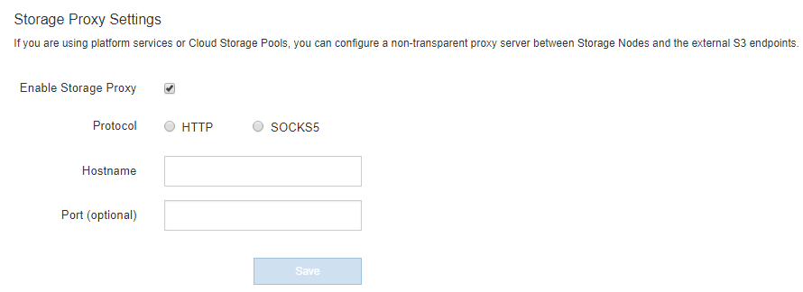

= 스토리지 프록시 설정을 구성합니다
:allow-uri-read: 
:icons: font
:imagesdir: ../media/

[role="lead"]
플랫폼 서비스 또는 클라우드 스토리지 풀을 사용하는 경우 스토리지 노드와 외부 S3 엔드포인트 간에 투명하지 않은 프록시를 구성할 수 있습니다. 예를 들어, 플랫폼 서비스 메시지를 인터넷의 끝점과 같은 외부 끝점으로 보내려면 투명하지 않은 프록시가 필요할 수 있습니다.

.시작하기 전에
* 특정 액세스 권한이 있습니다.
* 를 사용하여 그리드 관리자에 로그인했습니다 link:../admin/web-browser-requirements.html["지원되는 웹 브라우저"].

.이 작업에 대해
단일 스토리지 프록시에 대한 설정을 구성할 수 있습니다.

.단계
. 구성 * > * 보안 * > * 프록시 설정 * 을 선택합니다.
+
스토리지 프록시 설정 페이지가 나타납니다. 기본적으로 보조 아이콘 메뉴에서 * 스토리지 * 가 선택됩니다.

+
image::../media/proxy_settings_menu_storage.png[프록시 설정 메뉴 - 스토리지]

. 스토리지 프록시 사용 * 확인란을 선택합니다.
+
스토리지 프록시 구성에 대한 필드가 나타납니다.

+

. 투명하지 않은 스토리지 프록시에 대한 프로토콜을 선택합니다.
. 프록시 서버의 호스트 이름 또는 IP 주소를 입력합니다.
. 필요에 따라 프록시 서버에 연결하는 데 사용되는 포트를 입력합니다.
+
프로토콜의 기본 포트(HTTP의 경우 80, SOCKS5의 경우 1080)를 사용하는 경우 이 필드를 비워 둘 수 있습니다.

. 저장 * 을 선택합니다.
+
스토리지 프록시를 저장한 후 플랫폼 서비스 또는 클라우드 스토리지 풀의 새 엔드포인트를 구성 및 테스트할 수 있습니다.

+

NOTE: 프록시 변경 사항이 적용되려면 최대 10분이 소요될 수 있습니다.

. 프록시 서버의 설정을 확인하여 StorageGRID의 플랫폼 서비스 관련 메시지가 차단되지 않는지 확인합니다.

.작업을 마친 후
스토리지 프록시를 비활성화해야 하는 경우 * 스토리지 프록시 사용 * 확인란의 선택을 취소하고 * 저장 * 을 선택합니다.

.관련 정보
* link:networking-and-ports-for-platform-services.html["플랫폼 서비스를 위한 네트워크 및 포트"]
* link:../ilm/index.html["ILM을 사용하여 개체를 관리합니다"]

