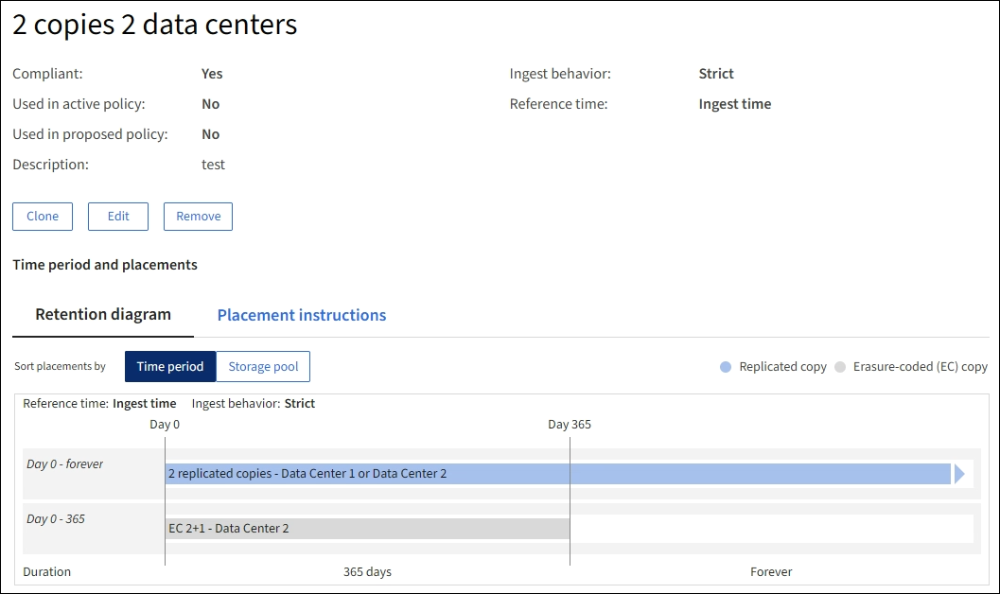
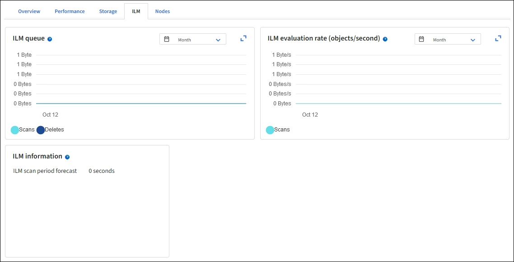

= ILM 정책 및 ILM 규칙 사용
:allow-uri-read: 
:icons: font
:imagesdir: ../media/

[role="lead"]
스토리지 요구사항이 변경되면 다른 정책을 배치하거나 정책과 연결된 ILM 규칙을 수정해야 할 수 있습니다. ILM 메트릭을 확인하여 시스템 성능을 결정할 수 있습니다.

.시작하기 전에
* 를 사용하여 그리드 관리자에 로그인했습니다 link:../admin/web-browser-requirements.html["지원되는 웹 브라우저"].
* 특정 액세스 권한이 있습니다.

== ILM 정책을 봅니다

활성, 제안 및 기간별 ILM 정책을 보려면

. ILM * > * 정책 * 을 선택합니다.
. 필요에 따라 * 활성 정책 *, * 제안된 정책 * 또는 * 정책 기록 * 을 선택하여 각 정책에 대한 세부 정보를 봅니다. 각 탭에서 * 정책 규칙 * 및 * 보존 다이어그램 * 을 선택할 수 있습니다.

image::../media/ilm_policy_active_proposed_history_tabs.png[ILM 정책 탭]

== 기간별 ILM 정책을 복제합니다

기간별 ILM 정책을 클론하려면 다음을 수행합니다.

. ILM * > * 정책 * > * 정책 기록 * 을 선택합니다.
. 제안된 정책이 있는 경우 해당 정책을 제거합니다.
. 복제할 정책에 대한 라디오 버튼을 선택한 다음 * 복제 기록 정책 * 을 선택합니다.
. 의 지침에 따라 필요한 세부 정보를 작성합니다 link:creating-proposed-ilm-policy.html["제안된 ILM 정책을 생성합니다"].

CAUTION: 잘못 구성된 ILM 정책으로 인해 복구할 수 없는 데이터 손실이 발생할 수 있습니다. ILM 정책을 활성화하기 전에 ILM 정책 및 ILM 규칙을 주의 깊게 검토한 다음 ILM 정책을 시뮬레이션합니다. ILM 정책이 의도한 대로 작동할 것인지 항상 확인하십시오.

== 제안된 ILM 정책을 제거합니다

제안된 정책을 제거하려면 다음을 수행합니다.

. ILM * > * 정책 * > * 제안된 정책 * 을 선택합니다.
. Actions * > * Remove * 를 선택합니다.

제안된 정책과 제안된 정책 탭이 제거됩니다.

== ILM 규칙 세부 정보를 봅니다

규칙의 보존 다이어그램 및 배치 지침을 포함하여 ILM 규칙에 대한 세부 정보를 보려면 다음을 수행합니다.

. ILM * > * 규칙 * 을 선택합니다.
. 세부 정보를 보려는 규칙을 선택합니다. 예:
+

또한 세부 정보 페이지를 사용하여 규칙을 복제, 편집 또는 제거할 수 있습니다.

== ILM 규칙 클론 복제

제안된 ILM 정책 또는 활성 ILM 정책에 사용되는 규칙은 편집할 수 없습니다. 대신 규칙을 클론 복제하고 클론 복제된 복사본을 필요한 변경 작업을 수행할 수 있습니다. 그런 다음 필요한 경우 제안된 정책에서 원래 규칙을 제거하고 수정된 버전으로 바꿀 수 있습니다. StorageGRID 버전 10.2 이하를 사용하여 ILM 규칙을 생성한 경우에는 클론 복제할 수 없습니다.

활성 ILM 정책에 복제된 규칙을 추가하기 전에 개체의 배치 지침을 변경하면 시스템에 대한 로드가 증가할 수 있습니다.

.단계
. ILM * > * 규칙 * 을 선택합니다.
. 클론 복제할 규칙의 확인란을 선택한 다음 * Clone * 을 선택합니다. 또는 규칙 이름을 선택한 다음 규칙 세부 정보 페이지에서 * 클론 * 을 선택합니다.
. 에 대한 단계에 따라 복제된 규칙을 업데이트합니다 <<ILM 규칙을 편집합니다,ILM 규칙 편집>> 및 link:create-ilm-rule-enter-details.html#use-advanced-filters-in-ilm-rules["ILM 규칙에서 고급 필터 사용"].
+
ILM 규칙을 복제할 때 새 이름을 입력해야 합니다.

== ILM 규칙을 편집합니다

필터 또는 배치 지침을 변경하려면 ILM 규칙을 편집해야 할 수 있습니다.

활성 ILM 정책 또는 제안된 ILM 정책에 사용되는 규칙은 편집할 수 없습니다. 대신 이러한 규칙을 클론 복제하고 클론 복제된 복사본을 필요한 사항으로 변경할 수 있습니다. 또한 시스템 제공 규칙을 편집할 수 없습니다. 복사본 2개를 만듭니다.

NOTE: 편집된 규칙을 활성 ILM 정책에 추가하기 전에 개체의 배치 지침을 변경하면 시스템에 부하가 증가할 수 있다는 점에 유의하십시오.

.단계
. ILM * > * 규칙 * 을 선택합니다.
. 편집할 규칙이 활성 ILM 정책 또는 제안된 ILM 정책에서 사용되지 않는지 확인합니다.
. 편집하려는 규칙이 사용 중이 아닌 경우 규칙의 확인란을 선택하고 * Actions * > * Edit * 를 선택합니다. 또는 규칙 이름을 선택한 다음 규칙 세부 정보 페이지에서 * 편집 * 을 선택합니다.
. ILM 규칙 편집 마법사의 페이지를 완료합니다. 필요한 경우 의 단계를 따릅니다 link:create-ilm-rule-enter-details.html["ILM 규칙 만들기"] 및 link:create-ilm-rule-enter-details.html#use-advanced-filters-in-ilm-rules["ILM 규칙에서 고급 필터 사용"].
+
ILM 규칙을 편집할 때는 해당 이름을 변경할 수 없습니다.

+

NOTE: 내역 정책에서 사용되는 규칙을 편집하는 경우, 가 표시됩니다 image:../media/icon_ilm_rule_historical.png["아이콘 ILM 규칙 이력"] 규칙을 볼 때 규칙에 대한 아이콘이 나타납니다. 이 아이콘은 규칙이 기록 규칙이 되었음을 나타냅니다.

== ILM 규칙을 제거합니다

현재 ILM 규칙 목록을 관리할 수 있도록 유지하려면 사용하지 않을 수 있는 ILM 규칙을 모두 제거해야 합니다.

.단계
현재 활성 정책 또는 제안된 정책에서 사용 중인 ILM 규칙을 제거하려면

. 활성 정책을 복제하거나 제안된 정책을 편집합니다.
. 정책에서 ILM 규칙을 제거합니다.
. 새 정책을 저장, 시뮬레이션 및 활성화하여 객체가 예상대로 보호되도록 합니다.

현재 사용되지 않는 ILM 규칙을 제거하려면 다음을 수행합니다.

. ILM * > * 규칙 * 을 선택합니다.
. 제거하려는 규칙이 활성 정책 또는 제안된 정책에서 사용되지 않는지 확인합니다.
. 제거하려는 규칙을 사용하지 않는 경우 규칙을 선택하고 * 제거 * 를 선택합니다. 여러 규칙을 선택하고 동시에 모두 제거할 수 있습니다.
. ILM 규칙을 제거할 것인지 확인하려면 * 예 * 를 선택합니다.
+
ILM 규칙이 제거됩니다.

+

NOTE: 내역 정책에 사용되는 규칙을 제거하면 이(가) 됩니다 image:../media/icon_ilm_rule_historical.png["아이콘 ILM 규칙 이력"] 규칙을 볼 때 규칙에 대한 아이콘이 나타납니다. 이 아이콘은 규칙이 기록 규칙이 되었음을 나타냅니다.

== ILM 메트릭을 봅니다

대기열에 있는 개체 수 및 평가율과 같은 ILM의 메트릭을 볼 수 있습니다. 이러한 메트릭을 모니터링하여 시스템 성능을 확인할 수 있습니다. 대기열 또는 평가 속도가 크면 시스템이 수집 속도를 따라가지 못하거나, 클라이언트 애플리케이션의 로드가 과도하거나, 비정상적인 상태가 있음을 나타낼 수 있습니다.

.단계
. 대시보드 * > * ILM * 을 선택합니다.
+

NOTE: 대시보드를 사용자 지정할 수 있으므로 ILM 탭을 사용하지 못할 수 있습니다.

. ILM 탭에서 메트릭을 모니터링합니다.
+
물음표를 선택할 수 있습니다 image:../media/icon_nms_question.png["물음표 아이콘"] ILM 탭의 항목에 대한 설명을 봅니다.

+

