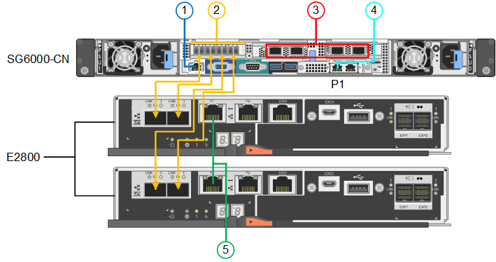
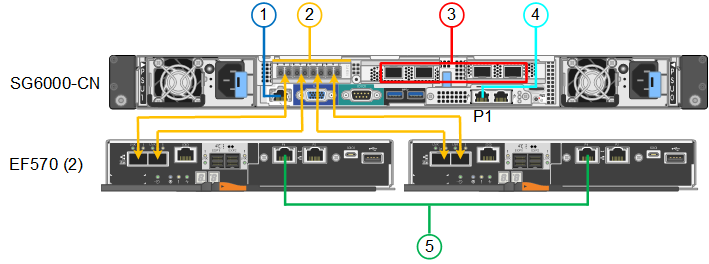

= 케이블 어플라이언스(SG6000)
:allow-uri-read: 
:icons: font
:imagesdir: ../media/

[role="lead"]
스토리지 컨트롤러를 SG6000-CN 컨트롤러에 연결하고, 세 컨트롤러 모두의 관리 포트를 연결하고, SG6000-CN 컨트롤러의 네트워크 포트를 StorageGRID용 그리드 네트워크 및 선택적 클라이언트 네트워크에 연결합니다.

.시작하기 전에
* 스토리지 컨트롤러 2개를 SG6000-CN 컨트롤러에 연결하기 위해 어플라이언스와 함께 제공된 광 케이블 4개가 있습니다.
* 관리 포트를 연결하기 위한 RJ-45 이더넷 케이블(최소 4개)이 있습니다.
* 네트워크 포트에 대한 다음 옵션 중 하나가 있습니다. 이러한 품목은 제품에는 제공되지 않습니다.
+
** 4개의 네트워크 포트를 연결하기 위한 TwinAx 케이블 1-4개.
** 포트에 광 케이블을 사용하려는 경우 SFP+ 또는 SFP28 트랜시버 1~4개
+

CAUTION: * 레이저 방사선에 노출될 위험 * - SFP 트랜시버를 분해하거나 제거하지 마십시오. 레이저 방사선에 노출될 수 있습니다.

.이 작업에 대해
다음 그림은 SG6060 및 SG6060X 어플라이언스의 컨트롤러 3개와 SG6000-CN 컴퓨팅 컨트롤러가 상단에, E2800 스토리지 컨트롤러 2개가 아래쪽에 있는 모습입니다. SG6060은 E2800A 컨트롤러를 사용하고 SG6060X는 E2800B 컨트롤러를 사용합니다.

NOTE: E2800 컨트롤러의 두 버전은 상호 연결 포트의 위치를 제외하고 동일한 사양과 기능을 제공합니다.

CAUTION: E2800A 및 E2800B 컨트롤러를 동일한 어플라이언스에서 사용하지 마십시오.

SG6060 연결:

SG6060X 연결:

image::../media/sg6000x_e2800B_connections.png[SG6060에서 E2800B 연결]

다음 그림은 SGF6024 어플라이언스에 있는 3개의 컨트롤러와 SG6000-CN 컴퓨팅 컨트롤러가 상단에 있고 두 개의 EF570 스토리지 컨트롤러가 컴퓨팅 컨트롤러 아래에 나란히 표시되어 있습니다.

SGF6024 연결:

[cols="1a,2a,2a,3a"]
|===
| 속성 표시기 | 포트 | 포트의 유형입니다 | 사용 

 a| 
1
 a| 
SG6000-CN 컨트롤러의 BMC 관리 포트
 a| 
1GbE(RJ-45)
 a| 
BMC 인터페이스에 액세스하는 네트워크에 연결합니다.

 a| 
2
 a| 
FC 연결 포트:

* SG6000-CN 컨트롤러에서 4
* 각 스토리지 컨트롤러에 2개씩

 a| 
16Gb/s FC 광 SFP+
 a| 
각 스토리지 컨트롤러를 SG6000-CN 컨트롤러에 연결합니다.

 a| 
3
 a| 
SG6000-CN 컨트롤러의 네트워크 포트 4개
 a| 
10/25GbE
 a| 
그리드 네트워크 및 StorageGRID용 클라이언트 네트워크에 연결합니다.

 a| 
4
 a| 
SG6000-CN 컨트롤러의 관리 네트워크 포트(그림에서 P1 레이블)
 a| 
1GbE(RJ-45)

* 중요: * 이 포트는 1000 BaseT/full에서만 작동하며 10메가비트 또는 100메가비트 속도를 지원하지 않습니다.
 a| 
SG6000-CN 컨트롤러를 StorageGRID용 관리 네트워크에 연결합니다.

 a| 
 a| 
SG6000-CN 컨트롤러의 가장 오른쪽 RJ-45 포트
 a| 
1GbE(RJ-45)

* 중요: * 이 포트는 1000 BaseT/full에서만 작동하며 10메가비트 또는 100메가비트 속도를 지원하지 않습니다.
 a| 
* 관리 네트워크에 대한 중복 연결을 원할 경우 관리 포트 1에 연결할 수 있습니다.
* 유선을 해제하고 임시 로컬 액세스(IP 169.254.0.1)에 사용할 수 있습니다.
* 설치 중에 DHCP 할당 IP 주소를 사용할 수 없는 경우 SG6000-CN 컨트롤러를 서비스 랩톱에 연결하는 데 사용할 수 있습니다.

 a| 
5
 a| 
각 스토리지 컨트롤러의 관리 포트 1
 a| 
1GbE(RJ-45)
 a| 
SANtricity 시스템 관리자에 액세스하는 네트워크에 연결합니다.

 a| 
 a| 
각 스토리지 컨트롤러의 관리 포트 2
 a| 
1GbE(RJ-45)
 a| 
기술 지원용으로 예약되어 있습니다.

|===
.단계
. 이더넷 케이블을 사용하여 SG6000-CN 컨트롤러의 BMC 관리 포트를 관리 네트워크에 연결합니다.
+
이 연결은 선택 사항이지만 지원을 원활하게 하는 것이 좋습니다.

. 스토리지 컨트롤러의 4개의 광 케이블과 4개의 SFP+ 트랜시버를 사용하여 각 스토리지 컨트롤러의 FC 포트 2개를 SG6000-CN 컨트롤러의 FC 포트에 연결합니다.
. TwinAx 케이블 또는 광 케이블과 SFP+ 또는 SFP28 트랜시버를 사용하여 SG6000-CN 컨트롤러의 네트워크 포트를 해당 네트워크 스위치에 연결합니다.
+

NOTE: 네트워크 포트 4개는 동일한 링크 속도를 사용해야 합니다. 10GbE 링크 속도를 사용하려는 경우 SFP+ 트랜시버를 설치합니다. 25GbE 링크 속도를 사용하려는 경우 SFP28 트랜시버를 설치합니다.

+
** 고정 포트 결합 모드(기본값)를 사용하려는 경우 표 에 나와 있는 대로 포트를 StorageGRID 그리드 및 클라이언트 네트워크에 연결합니다.
+
[cols="1a,2a"]
|===
| 포트 | 연결 대상... 

 a| 
포트 1
 a| 
클라이언트 네트워크(옵션)

 a| 
포트 2
 a| 
그리드 네트워크

 a| 
포트 3
 a| 
클라이언트 네트워크(옵션)

 a| 
포트 4
 a| 
그리드 네트워크

|===
** Aggregate 포트 결합 모드를 사용하려는 경우 하나 이상의 네트워크 포트를 하나 이상의 스위치에 연결합니다. 단일 장애 지점이 발생하지 않도록 4개 포트 중 2개 이상을 연결해야 합니다. 단일 LACP 결합에 둘 이상의 스위치를 사용하는 경우 스위치는 MLAG 또는 동급 스위치를 지원해야 합니다.

. StorageGRID용 관리 네트워크를 사용하려는 경우 이더넷 케이블을 사용하여 SG6000-CN 컨트롤러의 관리 네트워크 포트를 관리 네트워크에 연결합니다.
. SANtricity 시스템 관리자용 관리 네트워크를 사용하려면 이더넷 케이블을 사용하여 각 스토리지 컨트롤러(왼쪽의 RJ-45 포트)의 관리 포트 1(P1)을 SANtricity 시스템 관리자용 관리 네트워크에 연결합니다.
+
스토리지 컨트롤러(오른쪽의 RJ-45 포트)에서 관리 포트 2(P2)를 사용하지 마십시오. 이 포트는 기술 지원을 위해 예약되어 있습니다.

.관련 정보
link:../installconfig/port-bond-modes-for-sg6000-cn-controller.html["포트 결합 모드(SG6000-CN 컨트롤러)"]
