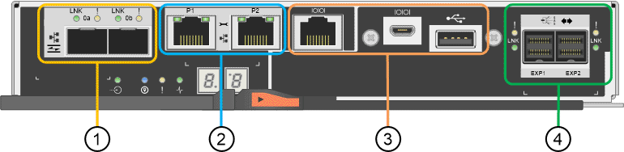

= SG6000 컨트롤러
:allow-uri-read: 
:icons: font
:imagesdir: ../media/

[role="lead"]
StorageGRID SG6000 어플라이언스의 각 모델에는 모델에 따라 1U 엔클로저의 SG6000-CN 컴퓨팅 컨트롤러와 2U 또는 4U 엔클로저의 이중 E-Series 스토리지 컨트롤러가 포함됩니다. 각 컨트롤러 유형에 대한 자세한 내용은 다이어그램을 참조하십시오.

== SG6000-CN 컴퓨팅 컨트롤러

* 어플라이언스에 대한 컴퓨팅 리소스를 제공합니다.
* StorageGRID 어플라이언스 설치 프로그램을 포함합니다.
+

NOTE: StorageGRID 소프트웨어는 어플라이언스에 사전 설치되어 있지 않습니다. 이 소프트웨어는 어플라이언스를 배포할 때 관리 노드에서 검색됩니다.

* 는 그리드 네트워크, 관리자 네트워크 및 클라이언트 네트워크를 포함하여 세 개의 StorageGRID 네트워크에 모두 연결할 수 있습니다.
* E-Series 스토리지 컨트롤러에 연결하고 이니시에이터로 작동합니다.

=== SG6000-CN 커넥터

image::../media/sg6000_cn_rear_connectors.gif[SG6000-CN 후면 커넥터]

[cols="1a,2a,2a,3a"]
|===
| 속성 표시기 | 포트 | 유형 | 사용 

 a| 
1
 a| 
상호 연결 포트 1-4
 a| 
광 미디어를 내장한 16Gb/s FC(Fibre Channel
 a| 
SG6000-CN 컨트롤러를 E2800 컨트롤러에 연결합니다(각 E2800에 2개 연결).

 a| 
2
 a| 
네트워크 포트 1-4
 a| 
케이블 또는 SFP 트랜시버 유형, 스위치 속도 및 구성된 링크 속도를 기반으로 한 10GbE 또는 25GbE
 a| 
그리드 네트워크 및 StorageGRID용 클라이언트 네트워크에 연결합니다.

 a| 
3
 a| 
BMC 관리 포트
 a| 
1GbE(RJ-45)
 a| 
SG6000-CN 베이스보드 관리 컨트롤러에 연결합니다.

 a| 
4
 a| 
진단 및 지원 포트
 a| 
* VGA
* 직렬, 115200 8-N-1
* USB

 a| 
기술 지원용으로 예약되어 있습니다.

 a| 
5
 a| 
관리 네트워크 포트 1
 a| 
1GbE(RJ-45)
 a| 
StorageGRID용 관리 네트워크에 SG6000-CN을 연결합니다.

 a| 
6
 a| 
관리 네트워크 포트 2
 a| 
1GbE(RJ-45)
 a| 
옵션:

* StorageGRID용 관리 네트워크에 대한 중복 연결을 위해 관리 포트 1과 연결합니다.
* 유선을 해제하고 임시 로컬 액세스(IP 169.254.0.1)를 위해 사용 가능한 상태로 둡니다.
* 설치하는 동안 DHCP 할당 IP 주소를 사용할 수 없는 경우 IP 구성에 포트 2를 사용합니다.

|===

== SGF6024: EF570 스토리지 컨트롤러

* 페일오버 지원을 위한 2개의 컨트롤러
* 드라이브의 데이터 스토리지를 관리합니다.
* 이중 구성에서 표준 E-Series 컨트롤러로 작동합니다.
* SANtricity OS 소프트웨어(컨트롤러 펌웨어)를 포함합니다.
* 스토리지 하드웨어를 모니터링하고 경고, AutoSupport 기능 및 드라이브 보안 기능을 관리하기 위한 SANtricity 시스템 관리자를 포함합니다.
* SG6000-CN 컨트롤러에 연결하고 플래시 스토리지에 대한 액세스를 제공합니다.

=== EF570 커넥터

image::../media/ef570_rear_connectors.gif[EF570 후면 커넥터]

[cols="1a,2a,2a,3a"]
|===
| 속성 표시기 | 포트 | 유형 | 사용 

 a| 
1
 a| 
상호 연결 포트 1 및 2
 a| 
16Gb/s FC 광 SFP
 a| 
각 EF570 컨트롤러를 SG6000-CN 컨트롤러에 연결합니다.

SG6000-CN 컨트롤러에 대한 4개의 연결이 있습니다(각 EF570에서 2개).

 a| 
2
 a| 
진단 및 지원 포트
 a| 
* RJ-45 직렬 포트
* 마이크로 USB 직렬 포트
* USB 포트

 a| 
기술 지원용으로 예약되어 있습니다.

 a| 
3
 a| 
드라이브 확장 포트
 a| 
12Gb/s SAS
 a| 
사용 안 합니다. SGF6024 어플라이언스는 확장 드라이브 쉘프를 지원하지 않습니다.

 a| 
4
 a| 
관리 포트 1 및 2
 a| 
1Gb(RJ-45) 이더넷
 a| 
* 포트 1은 브라우저에서 SANtricity 시스템 관리자에 액세스하는 네트워크에 연결합니다.
* 포트 2는 기술 지원용으로 예약되어 있습니다.

|===

== SG6060 및 SG6060X:E2800 스토리지 컨트롤러

* 페일오버 지원을 위한 2개의 컨트롤러
* 드라이브의 데이터 스토리지를 관리합니다.
* 이중 구성에서 표준 E-Series 컨트롤러로 작동합니다.
* SANtricity OS 소프트웨어(컨트롤러 펌웨어)를 포함합니다.
* 스토리지 하드웨어를 모니터링하고 경고, AutoSupport 기능 및 드라이브 보안 기능을 관리하기 위한 SANtricity 시스템 관리자를 포함합니다.
* SG6000-CN 컨트롤러에 연결하고 스토리지에 대한 액세스를 제공합니다.

SG6060 및 SG6060X는 E2800 스토리지 컨트롤러를 사용합니다.

[cols="1a,2a,2a"]
|===
| 어플라이언스 | 컨트롤러 | HIC 

 a| 
SG6060
 a| 
E2800A 스토리지 컨트롤러 2개
 a| 
없음

 a| 
SG6060X
 a| 
E2800B 스토리지 컨트롤러 2개
 a| 
4-포트 HIC

|===
E2800A 및 E2800B 스토리지 컨트롤러는 상호 연결 포트의 위치를 제외하고 사양 및 기능에서 동일합니다.

CAUTION: E2800A 및 E2800B를 동일한 어플라이언스에 사용하지 마십시오.

=== E2800A 커넥터

[cols="1a,2a,2a,3a"]
|===
| 속성 표시기 | 포트 | 유형 | 사용 

 a| 
1
 a| 
상호 연결 포트 1 및 2
 a| 
16Gb/s FC 광 SFP
 a| 
E2800A 각 컨트롤러를 SG6000-CN 컨트롤러에 연결합니다.

SG6000-CN 컨트롤러에 대한 4개의 연결이 있습니다(각 E2800A에서 2개).

 a| 
2
 a| 
관리 포트 1 및 2
 a| 
1Gb(RJ-45) 이더넷
 a| 
* 포트 1 옵션:
+
** 관리 네트워크에 연결하여 SANtricity 시스템 관리자에 대한 직접 TCP/IP 액세스를 활성화합니다
** 스위치 포트 및 IP 주소를 저장하려면 유선 연결을 해제하십시오. 그리드 관리자 또는 스토리지 그리드 어플라이언스 설치 관리자 UI를 사용하여 SANtricity System Manager에 액세스합니다.

* 참고 *: 정확한 로그 타임스탬프를 위한 NTP 동기화와 같은 일부 선택적 SANtricity 기능은 포트 1을 유선으로 남겨 두도록 선택한 경우 사용할 수 없습니다.

* 참고 *: 포트 1을 유선으로 연결하지 않은 상태로 두면 StorageGRID 11.5 이상 및 SANtricity 11.70 이상이 필요합니다.

* 포트 2는 기술 지원용으로 예약되어 있습니다.

 a| 
3
 a| 
진단 및 지원 포트
 a| 
* RJ-45 직렬 포트
* 마이크로 USB 직렬 포트
* USB 포트

 a| 
기술 지원용으로 예약되어 있습니다.

 a| 
4
 a| 
드라이브 확장 포트 1 및 2
 a| 
12Gb/s SAS
 a| 
확장 쉘프에 있는 IOM의 드라이브 확장 포트에 포트를 연결합니다.

|===

=== E2800B 커넥터

image::../media/e2800B_controller_with_callouts.gif[E2800B 컨트롤러의 커넥터]

[cols="1a,2a,2a,3a"]
|===
| 속성 표시기 | 포트 | 유형 | 사용 

 a| 
1
 a| 
상호 연결 포트 1 및 2
 a| 
16Gb/s FC 광 SFP
 a| 
E2800B 각 컨트롤러를 SG6000-CN 컨트롤러에 연결합니다.

SG6000-CN 컨트롤러에 대한 4개의 연결이 있습니다(각 E2800B에서 2개).

 a| 
2
 a| 
관리 포트 1 및 2
 a| 
1Gb(RJ-45) 이더넷
 a| 
* 포트 1 옵션:
+
** 관리 네트워크에 연결하여 SANtricity 시스템 관리자에 대한 직접 TCP/IP 액세스를 활성화합니다
** 스위치 포트 및 IP 주소를 저장하려면 유선 연결을 해제하십시오. 그리드 관리자 또는 스토리지 그리드 어플라이언스 설치 관리자 UI를 사용하여 SANtricity System Manager에 액세스합니다.

* 참고 *: 정확한 로그 타임스탬프를 위한 NTP 동기화와 같은 일부 선택적 SANtricity 기능은 포트 1을 유선으로 남겨 두도록 선택한 경우 사용할 수 없습니다.

* 참고 *: 포트 1을 유선으로 연결하지 않은 상태로 두면 StorageGRID 11.5 이상 및 SANtricity 11.70 이상이 필요합니다.

* 포트 2는 기술 지원용으로 예약되어 있습니다.

 a| 
3
 a| 
진단 및 지원 포트
 a| 
* RJ-45 직렬 포트
* 마이크로 USB 직렬 포트
* USB 포트

 a| 
기술 지원용으로 예약되어 있습니다.

 a| 
4
 a| 
드라이브 확장 포트 1 및 2
 a| 
12Gb/s SAS
 a| 
확장 쉘프에 있는 IOM의 드라이브 확장 포트에 포트를 연결합니다.

|===

== SG6060 및 SG6060X: 확장 셸프 옵션용 IOM

확장 쉘프에는 스토리지 컨트롤러 또는 다른 확장 쉘프에 연결하는 2개의 I/O 모듈(IOM)이 포함되어 있습니다.

=== IOM 커넥터

image::../media/iom_connectors.gif[IOM 후면]

[cols="1a,2a,2a,3a"]
|===
| 속성 표시기 | 포트 | 유형 | 사용 

 a| 
1
 a| 
드라이브 확장 포트 1-4
 a| 
12Gb/s SAS
 a| 
각 포트를 스토리지 컨트롤러 또는 추가 확장 쉘프(있는 경우)에 연결합니다.

|===