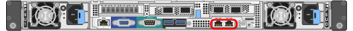

= 설치 정보 수집(SG6000)
:allow-uri-read: 
:icons: font
:imagesdir: ../media/

[role="lead"]
표를 사용하여 어플라이언스에 연결하는 각 네트워크에 필요한 정보를 기록합니다. 이러한 값은 하드웨어를 설치하고 구성하는 데 필요합니다.

TIP: 표를 사용하는 대신 ConfigBuilder와 함께 제공된 통합 문서를 사용합니다. ConfigBuilder 통합 문서를 사용하면 시스템 정보를 업로드하고 JSON 파일을 생성하여 StorageGRID 어플라이언스 설치 프로그램에서 일부 구성 단계를 자동으로 완료할 수 있습니다. 을 참조하십시오 link:automating-appliance-installation-and-configuration.html["어플라이언스 설치 및 구성 자동화"].

== 스토리지 컨트롤러의 SANtricity System Manager에 연결하는 데 필요한 정보입니다

어플라이언스(E2800 시리즈 컨트롤러 또는 EF570 컨트롤러)의 두 스토리지 컨트롤러를 SANtricity 시스템 관리자에 사용할 관리 네트워크에 연결합니다. 컨트롤러는 각 어플라이언스에 다음과 같이 있습니다.

* SG6060 및 SG6060X: 컨트롤러 A가 상단에 있고 컨트롤러 B가 하단에 있습니다.
* SGF6024: 컨트롤러 A는 왼쪽에 있고 컨트롤러 B는 오른쪽에 있습니다.

[cols="2a,1a,1a"]
|===
| 정보가 필요합니다 | 컨트롤러 A의 가치 | 컨트롤러 B의 값입니다 

 a| 
관리 포트 1에 연결할 이더넷 스위치 포트(컨트롤러에서 P1 레이블)
 a| 
 a| 

 a| 
관리 포트 1의 MAC 주소(포트 P1 근처의 레이블에 인쇄되어 있음)
 a| 
 a| 

 a| 
전원을 켠 후 사용할 수 있는 경우 관리 포트 1에 대해 DHCP 할당 IP 주소입니다

* 참고: * 스토리지 컨트롤러에 연결할 네트워크에 DHCP 서버가 포함된 경우 네트워크 관리자는 MAC 주소를 사용하여 DHCP 서버에서 할당한 IP 주소를 확인할 수 있습니다.
 a| 
 a| 

 a| 
관리 네트워크에서 어플라이언스에 사용할 고정 IP 주소입니다
 a| 
IPv4의 경우:

* IPv4 주소:
* 서브넷 마스크:
* 게이트웨이:

IPv6의 경우:

* IPv6 주소:
* 라우팅 가능한 IP 주소:
* 스토리지 컨트롤러 라우터 IP 주소:

 a| 
IPv4의 경우:

* IPv4 주소:
* 서브넷 마스크:
* 게이트웨이:

IPv6의 경우:

* IPv6 주소:
* 라우팅 가능한 IP 주소:
* 스토리지 컨트롤러 라우터 IP 주소:

 a| 
IP 주소 형식입니다
 a| 
다음 중 하나를 선택하십시오.

* IPv4
* IPv6

 a| 
다음 중 하나를 선택하십시오.

* IPv4
* IPv6

 a| 
속도 및 이중 모드

* 참고: * SANtricity 시스템 관리자 관리 네트워크의 이더넷 스위치가 자동 교섭으로 설정되어 있는지 확인해야 합니다.
 a| 
반드시:

* 자동 협상(기본값)

 a| 
반드시:

* 자동 협상(기본값)

|===

== SG6000-CN 컨트롤러를 관리 네트워크에 연결하는 데 필요한 정보입니다

StorageGRID용 관리 네트워크는 시스템 관리 및 유지 보수에 사용되는 선택적 네트워크입니다. 어플라이언스는 SG6000-CN 컨트롤러의 다음 1GbE 관리 포트를 사용하여 관리 네트워크에 연결됩니다.

[cols="2a,1a"]
|===
| 정보가 필요합니다 | 귀사의 가치 

 a| 
관리자 네트워크가 활성화되었습니다
 a| 
다음 중 하나를 선택하십시오.

* 아니요
* 예(기본값)

 a| 
네트워크 연결 모드
 a| 
다음 중 하나를 선택하십시오.

* 독립(기본값)
* Active - 백업

 a| 
다이어그램의 빨간색 원에 있는 왼쪽 포트의 스위치 포트(독립 네트워크 연결 모드의 기본 활성 포트)
 a| 

 a| 
다이어그램의 빨간색 원에 있는 오른쪽 포트의 스위치 포트(액티브-백업 네트워크 연결 모드만 해당)
 a| 

 a| 
관리자 네트워크 포트의 MAC 주소입니다

* 참고: * SG6000-CN 컨트롤러 전면에 있는 MAC 주소 레이블에는 BMC 관리 포트의 MAC 주소가 나열됩니다. 관리 네트워크 포트의 MAC 주소를 확인하려면 레이블의 16진수에 * 2 * 를 추가해야 합니다. 예를 들어 레이블의 MAC 주소가 * 09 * 로 끝나는 경우 관리 포트의 MAC 주소는 * 0B * 로 끝납니다. 레이블의 MAC 주소가 * (_y_) FF * 로 끝나는 경우 관리 포트의 MAC 주소는 * (_y_+1) 01 * 로 끝납니다. Windows에서 계산기를 열고, Programmer 모드로 설정하고, Hex를 선택하고, MAC 주소를 입력한 다음, * + 2 = * 를 입력하여 이 계산을 쉽게 수행할 수 있습니다.
 a| 

 a| 
전원을 켠 후 사용할 수 있는 경우, Admin Network 포트에 대해 DHCP가 할당한 IP 주소입니다

* 참고: * MAC 주소를 사용하여 할당된 IP를 조회하여 DHCP 할당 IP 주소를 확인할 수 있습니다.
 a| 
* IPv4 주소(CIDR):
* 게이트웨이:

 a| 
관리 네트워크의 어플라이언스 스토리지 노드에 사용할 고정 IP 주소입니다

* 참고: * 네트워크에 게이트웨이가 없는 경우 게이트웨이에 대해 동일한 정적 IPv4 주소를 지정합니다.
 a| 
* IPv4 주소(CIDR):
* 게이트웨이:

 a| 
관리 네트워크 서브넷(CIDR)
 a| 

|===

== SG6000-CN 컨트롤러에서 10/25-GbE 포트를 연결하고 구성하는 데 필요한 정보입니다

SG6000-CN 컨트롤러의 10/25-GbE 포트 4개는 StorageGRID 그리드 네트워크 및 선택적 클라이언트 네트워크에 연결됩니다.

[cols="2a,1a"]
|===
| 정보가 필요합니다 | 귀사의 가치 

 a| 
링크 속도
 a| 
다음 중 하나를 선택하십시오.

* 자동(기본값)
* 10GbE
* 25GbE

 a| 
포트 결합 모드
 a| 
다음 중 하나를 선택하십시오.

* 고정(기본값)
* 집계

 a| 
포트 1용 스위치 포트(고정 모드용 클라이언트 네트워크)
 a| 

 a| 
포트 2용 스위치 포트(고정 모드용 그리드 네트워크)
 a| 

 a| 
포트 3용 스위치 포트(고정 모드용 클라이언트 네트워크)
 a| 

 a| 
포트 4용 스위치 포트(고정 모드용 그리드 네트워크)
 a| 

|===

== SG6000-CN 컨트롤러를 그리드 네트워크에 연결하는 데 필요한 정보

StorageGRID용 그리드 네트워크는 모든 내부 StorageGRID 트래픽에 사용되는 필수 네트워크입니다. 어플라이언스는 SG6000-CN 컨트롤러의 10/25-GbE 포트를 사용하여 그리드 네트워크에 연결됩니다.

[cols="2a,1a"]
|===
| 정보가 필요합니다 | 귀사의 가치 

 a| 
네트워크 연결 모드
 a| 
다음 중 하나를 선택하십시오.

* Active-Backup(기본값)
* LACP(802.3ad)

 a| 
VLAN 태그 지정이 활성화되었습니다
 a| 
다음 중 하나를 선택하십시오.

* 아니요(기본값)
* 예

 a| 
VLAN 태그(VLAN 태그 지정이 활성화된 경우)
 a| 
0에서 4095 사이의 값을 입력합니다.

 a| 
전원을 켠 후 사용할 수 있는 경우 그리드 네트워크에 대해 DHCP 할당 IP 주소입니다
 a| 
* IPv4 주소(CIDR):
* 게이트웨이:

 a| 
그리드 네트워크에서 어플라이언스 스토리지 노드에 사용할 고정 IP 주소입니다

* 참고: * 네트워크에 게이트웨이가 없는 경우 게이트웨이에 대해 동일한 정적 IPv4 주소를 지정합니다.
 a| 
* IPv4 주소(CIDR):
* 게이트웨이:

 a| 
그리드 네트워크 서브넷(CIDR)
 a| 

|===

== SG6000-CN 컨트롤러를 클라이언트 네트워크에 연결하는 데 필요한 정보입니다

StorageGRID용 클라이언트 네트워크는 일반적으로 그리드에 대한 클라이언트 프로토콜 액세스를 제공하는 데 사용되는 선택적 네트워크입니다. 어플라이언스는 SG6000-CN 컨트롤러의 10/25-GbE 포트를 사용하여 클라이언트 네트워크에 연결됩니다.

[cols="2a,1a"]
|===
| 정보가 필요합니다 | 귀사의 가치 

 a| 
클라이언트 네트워크가 활성화되었습니다
 a| 
다음 중 하나를 선택하십시오.

* 아니요(기본값)
* 예

 a| 
네트워크 연결 모드
 a| 
다음 중 하나를 선택하십시오.

* Active-Backup(기본값)
* LACP(802.3ad)

 a| 
VLAN 태그 지정이 활성화되었습니다
 a| 
다음 중 하나를 선택하십시오.

* 아니요(기본값)
* 예

 a| 
VLAN 태그(VLAN 태그 지정이 활성화된 경우)
 a| 
0에서 4095 사이의 값을 입력합니다.

 a| 
전원을 켠 후 사용할 수 있는 경우 클라이언트 네트워크에 대해 DHCP 할당 IP 주소입니다
 a| 
* IPv4 주소(CIDR):
* 게이트웨이:

 a| 
클라이언트 네트워크의 어플라이언스 스토리지 노드에 사용할 고정 IP 주소입니다

* 참고: * 클라이언트 네트워크가 활성화된 경우 컨트롤러의 기본 라우트는 여기에 지정된 게이트웨이를 사용합니다.
 a| 
* IPv4 주소(CIDR):
* 게이트웨이:

|===

== SG6000-CN 컨트롤러를 BMC 관리 네트워크에 연결하는 데 필요한 정보입니다

다음 1GbE 관리 포트를 사용하여 SG6000-CN 컨트롤러의 BMC 인터페이스에 액세스할 수 있습니다. 이 포트는 IPMI(Intelligent Platform Management Interface) 표준을 사용하여 이더넷을 통한 컨트롤러 하드웨어의 원격 관리를 지원합니다.

image::../media/bmc_management_port.gif[BMC 관리 포트]

NOTE: Management API private endpoint, put/private/bmc를 포함하는 모든 어플라이언스에 대해 원격 IPMI 액세스를 설정하거나 해제할 수 있습니다.

[cols="2a,1a"]
|===
| 정보가 필요합니다 | 귀사의 가치 

 a| 
BMC 관리 포트에 연결할 이더넷 스위치 포트(다이어그램에서 원으로 표시됨)
 a| 

 a| 
전원을 켠 후 사용할 수 있는 경우 BMC 관리 네트워크에 대해 DHCP 할당 IP 주소입니다
 a| 
* IPv4 주소(CIDR):
* 게이트웨이:

 a| 
BMC 관리 포트에 사용할 고정 IP 주소입니다
 a| 
* IPv4 주소(CIDR):
* 게이트웨이:

|===
.관련 정보
* link:../installconfig/controllers-in-sg6000-appliances.html["SG6000 컨트롤러"]
* link:../installconfig/reviewing-appliance-network-connections.html["어플라이언스 네트워크 연결을 검토합니다"]
* link:../installconfig/port-bond-modes-for-sg6000-cn-controller.html["포트 결합 모드(SG6000-CN 컨트롤러)"]
* link:cabling-appliance-sg6000.html["케이블 어플라이언스(SG6000)"]
* link:../installconfig/setting-ip-configuration.html["StorageGRID IP 주소를 구성합니다"]

