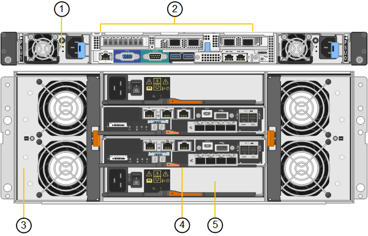

= SG6060 및 SG6060X 장비:개요
:allow-uri-read: 
:icons: font
:imagesdir: ../media/

[role="lead"]
StorageGRID SG6060 및 SG6060X 어플라이언스에는 각각 스토리지 컨트롤러 2개와 드라이브 60개가 포함된 컴퓨팅 컨트롤러 및 스토리지 컨트롤러 쉘프가 포함되어 있습니다.

필요에 따라 두 어플라이언스 모두에 60-드라이브 확장 쉘프를 추가할 수 있습니다. 스토리지 컨트롤러의 상호 연결 포트 위치를 제외하고 SG6060과 SG6060X 사이에는 사양이나 기능 차이가 없습니다.

== SG6060 및 SG6060X 구성 요소

SG6060 및 SG6060X 장비는 다음과 같은 구성 요소를 포함합니다.

[cols="1a,2a"]
|===
| 구성 요소 | 설명 

 a| 
컴퓨팅 컨트롤러
 a| 
SG6000-CN 컨트롤러, 다음을 포함하는 1랙 유닛(1U) 서버:

* 40개 코어(80개 스레드)
* 192GB RAM
* 최대 4 × 25Gbps 통합 이더넷 대역폭
* 4 × 16Gbps FC(Fibre Channel) 상호 연결
* 하드웨어 관리를 단순화하는 베이스보드 관리 컨트롤러(BMC)
* 중복 전원 공급 장치

 a| 
스토리지 컨트롤러 쉘프
 a| 
E-Series E2860 컨트롤러 쉘프(스토리지 어레이), 4U 쉘프:

* 스토리지 컨트롤러 페일오버 지원을 제공하는 2개의 E2800 시리즈 컨트롤러(이중 구성
+
** SG6060에는 E2800A 스토리지 컨트롤러가 포함되어 있습니다
** SG6060X에는 E2800B 스토리지 컨트롤러가 포함되어 있습니다

* 60개의 3.5인치 드라이브(SSD 2개, NL-SAS 드라이브 58개)를 보관할 수 있는 5개의 드로어 드라이브 쉘프
* 중복 전원 공급 장치 및 팬

 a| 
선택 사항: 스토리지 확장 쉘프

* 참고: * 확장 셸프는 초기 배포 중에 설치하거나 나중에 추가할 수 있습니다.
 a| 
E-Series DE460C 엔클로저, 4U 쉘프:

* 입출력 모듈(IOM) 2개
* 각각 12개의 NL-SAS 드라이브가 장착된 5개의 드로어, 총 60개의 드라이브
* 중복 전원 공급 장치 및 팬

각 SG6060 및 SG6060X 어플라이언스는 총 180개 드라이브에 대해 하나 또는 두 개의 확장 셸프를 가질 수 있습니다(이들 드라이브 중 두 개는 E-Series 읽기 캐시용으로 예약되어 있음).

|===

== SG6060 및 SG6060X 다이어그램

SG6060 및 SG6060X의 앞면은 동일합니다.

=== SG6060 또는 SG6060X 전면

이 그림은 1U 컴퓨팅 컨트롤러와 5개의 드라이브 드로어에 2개의 스토리지 컨트롤러와 60개의 드라이브를 포함하는 4U 쉘프를 포함하는 SG6060 또는 SG6060X의 전면을 보여줍니다.

image::../media/sg6060_front_view_with_and_without_bezels.gif[SG6060 앞면 모습]

[cols="1a,2a"]
|===
| 속성 표시기 | 설명 

 a| 
1
 a| 
전면 베젤이 있는 SG6000-CN 컴퓨팅 컨트롤러

 a| 
2
 a| 
E2860 컨트롤러 쉘프 및 전면 베젤(옵션 확장 쉘프가 동일한 것으로 표시됨)

 a| 
3
 a| 
전면 베젤이 분리된 SG6000-CN 컴퓨팅 컨트롤러

 a| 
4
 a| 
E2860 컨트롤러 쉘프 및 전면 베젤 분리(옵션 확장 쉘프가 동일한 것으로 표시됨)

|===

=== SG6060 후면

이 그림은 컴퓨팅 및 스토리지 컨트롤러, 팬 및 전원 공급 장치를 포함하여 SG6060의 뒷면을 보여줍니다.

image::../media/sg6060_rear_view.gif[SG6060 후면]

[cols="1a,2a"]
|===
| 속성 표시기 | 설명 

 a| 
1
 a| 
SG6000-CN 컴퓨팅 컨트롤러용 전원 공급 장치(1/2)

 a| 
2
 a| 
SG6000-CN 컴퓨팅 컨트롤러용 커넥터

 a| 
3
 a| 
E2860 컨트롤러 쉘프용 팬(1/2

 a| 
4
 a| 
E-Series E2800A 스토리지 컨트롤러(1/2) 및 커넥터

 a| 
5
 a| 
E2860 컨트롤러 쉘프용 전원 공급 장치(1/2

|===

=== SG6060X 후면

이 그림은 SG6060X의 후면을 보여줍니다.

[cols="1a,2a"]
|===
| 속성 표시기 | 설명 

 a| 
1
 a| 
SG6000-CN 컴퓨팅 컨트롤러용 전원 공급 장치(1/2)

 a| 
2
 a| 
SG6000-CN 컴퓨팅 컨트롤러용 커넥터

 a| 
3
 a| 
E2860 컨트롤러 쉘프용 팬(1/2

 a| 
4
 a| 
E-Series E2800B 스토리지 컨트롤러(1/2) 및 커넥터

 a| 
5
 a| 
E2860 컨트롤러 쉘프용 전원 공급 장치(1/2

|===

=== 확장 쉘프

이 그림은 입/출력 모듈(IOM), 팬 및 전원 공급 장치를 포함하여 SG6060 및 SG6060X용 확장 셸프(옵션)의 후면을 보여줍니다. 각 SG6060은 초기 설치에 포함될 수도 있고 나중에 추가할 수도 있는 하나 또는 두 개의 확장 셸프와 함께 설치할 수도 있습니다.

image::../media/de460c_expansion_shelf_rear_view.gif[확장 쉘프 뒷면]

[cols="1a,2a"]
|===
| 속성 표시기 | 설명 

 a| 
1
 a| 
확장 셸프용 팬(1/2

 a| 
2
 a| 
확장 쉘프의 IOM(1/2)

 a| 
3
 a| 
확장 셸프용 전원 공급 장치(1/2

|===