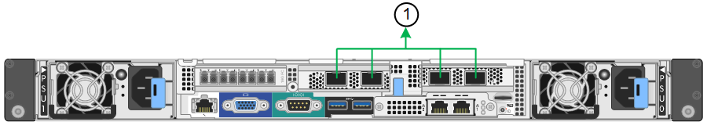

= 포트 결합 모드(SG6000-CN 컨트롤러)
:allow-uri-read: 
:icons: font
:imagesdir: ../media/

[role="lead"]
시기 link:configuring-network-links.html["네트워크 링크 구성"] SG6000-CN 컨트롤러의 경우, Grid Network 및 선택적 Client Network에 연결되는 10/25-GbE 포트와 선택적 Admin Network에 연결되는 1GbE 관리 포트에 포트 결합을 사용할 수 있습니다. 포트 본딩을 사용하면 StorageGRID 네트워크와 어플라이언스 간에 중복 경로를 제공하여 데이터를 보호할 수 있습니다.

== 10/25-GbE 포트의 네트워크 연결 모드

SG6000-CN 컨트롤러의 10/25-GbE 네트워킹 포트는 그리드 네트워크 및 클라이언트 네트워크 연결을 위한 고정 포트 결합 모드 또는 집계 포트 결합 모드를 지원합니다.

=== 고정 포트 결합 모드

고정 모드는 10/25-GbE 네트워킹 포트의 기본 구성입니다.

image::../media/sg6000_cn_fixed_port.gif[고정 포트 본드 모드]

[cols="1a,3a"]
|===
| 속성 표시기 | 어떤 포트가 연결되어 있는지 확인합니다 

 a| 
c
 a| 
이 네트워크를 사용하는 경우 포트 1과 3이 클라이언트 네트워크에 대해 함께 연결됩니다.

 a| 
g
 a| 
포트 2와 4는 그리드 네트워크를 위해 서로 연결되어 있습니다.

|===
고정 포트 결합 모드를 사용할 때 포트는 액티브-백업 모드 또는 링크 통합 제어 프로토콜 모드(802.3ad)를 사용하여 본드 결합할 수 있습니다.

* 액티브-백업 모드(기본값)에서는 한 번에 하나의 포트만 활성화됩니다. 활성 포트에 장애가 발생하면 백업 포트가 자동으로 페일오버 연결을 제공합니다. 포트 4는 포트 2(그리드 네트워크)에 대한 백업 경로를 제공하고 포트 3은 포트 1(클라이언트 네트워크)에 대한 백업 경로를 제공합니다.
* LACP 모드에서 각 포트 쌍은 컨트롤러와 네트워크 간에 논리 채널을 형성하므로 더 높은 처리량을 허용합니다. 한 포트에 장애가 발생해도 다른 포트는 계속 채널을 제공합니다. 처리량은 감소하지만 연결성은 영향을 받지 않습니다.

NOTE: 중복 연결이 필요하지 않은 경우 각 네트워크에 대해 하나의 포트만 사용할 수 있습니다. 그러나 StorageGRID가 설치된 후 그리드 관리자에서 경고가 트리거되어 링크가 다운되었음을 나타냅니다. 이 포트는 의도적으로 분리되어 있으므로 이 알림을 안전하게 비활성화할 수 있습니다.

Grid Manager에서 * Alert * > * Rules * 를 선택하고 규칙을 선택한 다음 * Edit rule * 을 클릭합니다. 그런 다음 * 사용 * 확인란의 선택을 취소합니다.

=== 애그리게이트 포트 결합 모드

애그리게이트 포트 결합 모드는 각 StorageGRID 네트워크의 성능을 크게 높이고 추가 페일오버 경로를 제공합니다.

[cols="1a,3a"]
|===
| 속성 표시기 | 어떤 포트가 연결되어 있는지 확인합니다 

 a| 
1
 a| 
연결된 모든 포트는 단일 LACP 결합으로 그룹화되므로 모든 포트를 그리드 네트워크 및 클라이언트 네트워크 트래픽에 사용할 수 있습니다.

|===
애그리게이트 포트 결합 모드를 사용하려는 경우:

* LACP 네트워크 결합 모드를 사용해야 합니다.
* 각 네트워크에 대해 고유한 VLAN 태그를 지정해야 합니다. 이 VLAN 태그는 네트워크 트래픽이 올바른 네트워크로 라우팅되도록 각 네트워크 패킷에 추가됩니다.
* VLAN 및 LACP를 지원할 수 있는 스위치에 포트를 연결해야 합니다. LACP 결합에 여러 스위치가 사용되는 경우 스위치는 MLAG(Multi-Chassis Link Aggregation Group) 또는 이와 동등한 스위치를 지원해야 합니다.
* VLAN, LACP, MLAG 또는 이와 동등한 기능을 사용하도록 스위치를 구성하는 방법을 이해합니다.

4개의 10GbE 포트 모두를 사용하지 않으려면 1개, 2개 또는 3개의 포트를 사용할 수 있습니다. 둘 이상의 포트를 사용하면 10/25-GbE 포트 중 하나에 장애가 발생하더라도 일부 네트워크 연결이 계속 유지될 가능성을 극대화할 수 있습니다.

NOTE: 4개 미만의 포트를 사용하도록 선택한 경우 StorageGRID가 설치된 후 그리드 관리자에서 하나 이상의 알람이 발생하므로 케이블이 분리되었음을 나타냅니다. 알람을 안전하게 확인할 수 있습니다.

== 1GbE 관리 포트의 네트워크 연결 모드

SG6000-CN 컨트롤러의 1GbE 관리 포트 2개의 경우 독립 네트워크 연결 모드 또는 Active-Backup 네트워크 연결 모드를 선택하여 선택적 관리 네트워크에 연결할 수 있습니다.

독립 모드에서는 왼쪽에 있는 관리 포트만 관리 네트워크에 연결됩니다. 이 모드는 중복 경로를 제공하지 않습니다. 오른쪽의 관리 포트가 연결되어 있지 않으며 임시 로컬 연결에 사용할 수 있습니다(IP 주소 169.254.0.1 사용).

Active-Backup 모드에서는 두 관리 포트가 모두 관리 네트워크에 연결됩니다. 한 번에 하나의 포트만 활성화됩니다. 활성 포트에 장애가 발생하면 백업 포트가 자동으로 페일오버 연결을 제공합니다. 이러한 두 개의 물리적 포트를 하나의 논리 관리 포트에 연결하면 관리 네트워크에 대한 중복 경로가 제공됩니다.

NOTE: 1GbE 관리 포트가 Active-Backup 모드로 구성되어 있을 때 SG6000-CN 컨트롤러에 일시적으로 로컬 연결이 필요한 경우 두 관리 포트에서 케이블을 분리하고 오른쪽의 관리 포트에 임시 케이블을 연결한 다음 IP 주소 169.254.0.1을 사용하여 어플라이언스에 액세스합니다.

image::../media/sg6000_cn_bonded_managemente_ports.png[1GbE 포트]

[cols="1a,3a"]
|===
| 속성 표시기 | 네트워크 연결 모드 

 a| 
A
 a| 
두 관리 포트는 모두 관리 네트워크에 연결된 하나의 논리 관리 포트에 연결됩니다.

 a| 
나는
 a| 
왼쪽의 포트는 관리 네트워크에 연결되어 있습니다. 오른쪽의 포트는 임시 로컬 연결(IP 주소 169.254.0.1)에 사용할 수 있습니다.

|===