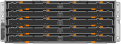

= 박스 포장을 풉니다
:allow-uri-read: 
:icons: font
:imagesdir: ../media/

[role="lead"]
StorageGRID 제품을 설치하기 전에 모든 상자의 포장을 풀고 내용물을 포장 명세서에 있는 품목과 비교합니다.

== SGF6112 어플라이언스

=== 하드웨어

[cols="1a,4a"]
|===
| 항목 | 어떻게 보이는지 

 a| 
SGF6112
 a| 
image::../media/sg6000_cn_front_without_bezel.gif[전면 드라이브 SGF6112 어플라이언스]

 a| 
레일 키트(지침 포함
 a| 
image::../media/rail_kit.gif[레일 키트]

 a| 
전면 베젤
 a| 
image::../media/sgf_6112_front_bezel.png[전면 베젤]

|===

=== 전원 코드

SGF6112 기기에는 다음 전원 코드가 포함되어 있습니다.

TIP: 캐비닛에는 제품과 함께 제공된 전원 코드 대신 사용하는 특수 전원 코드가 있을 수 있습니다.

[cols="1a,4a"]
|===
| 항목 | 어떻게 보이는지 

 a| 
해당 국가용 전원 코드 2개
 a| 
image::../media/power_cords.gif[전원 코드]

|===

== SG6000 어플라이언스

=== SG6060 하드웨어

[cols="1a,4a"]
|===
| 항목 | 어떻게 보이는지 

 a| 
SG6000-CN 컨트롤러
 a| 
image::../media/sg6000_cn_front_without_bezel.gif[SG6000-CN 컨트롤러]

 a| 
E2860 컨트롤러 쉘프, 드라이브 설치 안 됨
 a| 

 a| 
전면 베젤 2개
 a| 
image::../media/sg6000_front_bezels_for_table.gif[전면 베젤]

 a| 
지침이 있는 레일 키트 2개
 a| 
image::../media/rail_kit.gif[레일 키트]

 a| 
60개 드라이브(SSD 2개 및 NL-SAS 58개)
 a| 
image::../media/sg5760_drive.gif[드라이브]

 a| 
네 개의 핸들
 a| 
image::../media/handles.gif[SG5760 핸들]

 a| 
사각 구멍 랙 설치용 후면 브래킷 및 케이지 너트
 a| 
image::../media/back_brackets_table_size.gif[SG5760용 후면 브래킷 및 케이지 너트]

|===

=== SG6060 확장 쉘프

[cols="1a,4a"]
|===
| 항목 | 어떻게 보이는지 

 a| 
드라이브가 설치되지 않은 확장 쉘프
 a| 

 a| 
전면 베젤
 a| 
image::../media/front_bezel_for_table_de460c.gif[전면 베젤 DE460C]

 a| 
NL-SAS 드라이브 60개
 a| 
image::../media/sg5760_drive.gif[드라이브]

 a| 
지침이 있는 레일 키트 1개
 a| 
image::../media/rail_kit.gif[레일 키트]

 a| 
네 개의 핸들
 a| 
image::../media/handles.gif[SG5760 핸들]

 a| 
사각 구멍 랙 설치용 후면 브래킷 및 케이지 너트
 a| 
image::../media/back_brackets_table_size.gif[SG5760용 후면 브래킷 및 케이지 너트]

|===

=== SGF6024 하드웨어

[cols="1a,4a"]
|===
| 항목 | 어떻게 보이는지 

 a| 
SG6000-CN 컨트롤러
 a| 
image::../media/sg6000_cn_front_without_bezel.gif[SG6000-CN 컨트롤러]

 a| 
24개의 솔리드 스테이트(플래시) 드라이브가 설치된 EF570 플래시 어레이
 a| 
image::../media/de224c_with_drives.gif[EF570 컨트롤러 쉘프]

 a| 
전면 베젤 2개
 a| 
image::../media/sgf6024_front_bezels_for_table.png[SG6024 전면 베젤]

 a| 
지침이 있는 레일 키트 2개
 a| 
image::../media/rail_kit.gif[레일 키트]

 a| 
선반 엔드캡
 a| 
image::../media/endcaps.png[엔드캡]

|===

=== 케이블 및 커넥터

SG6000 어플라이언스에는 다음 케이블 및 커넥터가 포함되어 있습니다.

TIP: 캐비닛에는 제품과 함께 제공된 전원 코드 대신 사용하는 특수 전원 코드가 있을 수 있습니다.

[cols="1a,4a"]
|===
| 항목 | 어떻게 보이는지 

 a| 
해당 국가용 전원 코드 4개
 a| 
image::../media/power_cords.gif[전원 코드]

 a| 
광 케이블 및 SFP 트랜시버
 a| 
image::../media/fc_cable_and_sfp.gif[광 케이블 및 SFP]

* FC 상호 연결 포트를 위한 광 케이블 4개
* 16Gb/s FC를 지원하는 SFP+ 트랜시버 4개

 a| 
선택 사항: 각 SG6060 확장 쉘프를 연결하기 위한 SAS 케이블 2개
 a| 
image::../media/sas_cable.gif[SAS 케이블]

|===

== SG5700 어플라이언스

=== 하드웨어

[cols="1a,4a"]
|===
| 항목 | 어떻게 보이는지 

 a| 
12개의 드라이브가 설치된 SG5712 어플라이언스
 a| 
image::../media/de212c_table_size.gif[SG5712 2U 어플라이언스]

 a| 
드라이브가 설치되지 않은 SG5760 어플라이언스
 a| 

 a| 
제품의 전면 베젤
 a| 
image::../media/sg5700_front_bezels.gif[SG5712 및 SG5760의 베젤]

 a| 
레일 키트(지침 포함
 a| 
image::../media/rail_kit.gif[레일 키트]

 a| 
SG5760: 60개의 드라이브
 a| 
image::../media/sg5760_drive.gif[드라이브]

 a| 
SG5760: 핸들
 a| 
image::../media/handles.gif[SG5760 핸들]

 a| 
SG5760: 사각 구멍 랙 설치용 후면 브래킷 및 케이지 너트
 a| 
image::../media/back_brackets_table_size.gif[SG5760용 후면 브래킷 및 케이지 너트]

|===

=== 케이블 및 커넥터

SG5700 어플라이언스에 대한 배송에는 다음 케이블 및 커넥터가 포함됩니다.

TIP: 캐비닛에는 제품과 함께 제공된 전원 코드 대신 사용하는 특수 전원 코드가 있을 수 있습니다.

[cols="1a,4a"]
|===
| 항목 | 어떻게 보이는지 

 a| 
해당 국가용 전원 코드 2개
 a| 
image::../media/power_cords.gif[전원 코드]

 a| 
광 케이블 및 SFP 트랜시버
 a| 
image::../media/fc_cable_and_sfp.gif[광 케이블 및 SFP]

* FC 상호 연결 포트를 위한 광 케이블 2개
* 4개의 16Gb/s FC 상호 연결 포트 및 4개의 10GbE 네트워크 포트와 호환되는 8개의 SFP+ 트랜시버입니다

|===

== SG100 및 SG1000 어플라이언스

=== 하드웨어

[cols="1a,4a"]
|===
| 항목 | 어떻게 보이는지 

 a| 
SG100 또는 SG1000
 a| 
image::../media/sg6000_cn_front_without_bezel.gif[정면은 SG 100 또는 SG1000 서비스 어플라이언스를 구동합니다]

 a| 
레일 키트(지침 포함
 a| 
image::../media/rail_kit.gif[레일 키트]

|===

=== 전원 코드

SG100 또는 SG1000 어플라이언스에 대한 배송에는 다음 전원 코드가 포함됩니다.

TIP: 캐비닛에는 제품과 함께 제공된 전원 코드 대신 사용하는 특수 전원 코드가 있을 수 있습니다.

[cols="1a,4a"]
|===
| 항목 | 어떻게 보이는지 

 a| 
해당 국가용 전원 코드 2개
 a| 
image::../media/power_cords.gif[전원 코드]

|===