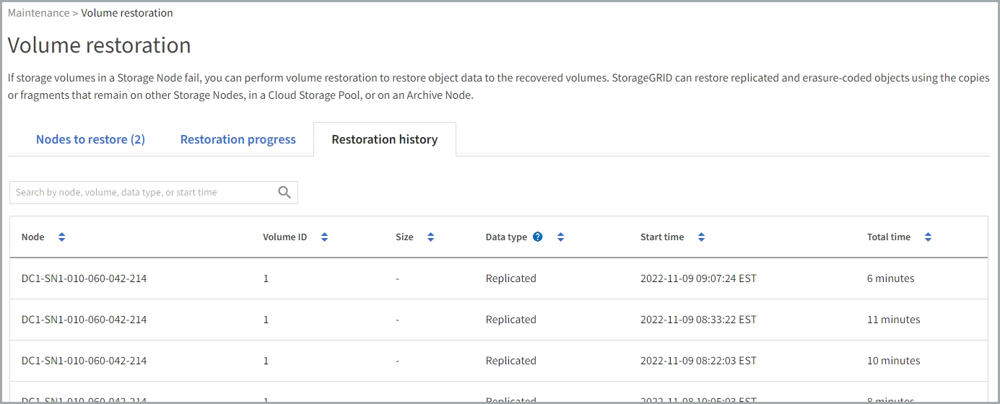

= Grid Manager를 사용하여 개체 데이터를 복원합니다
:allow-uri-read: 
:icons: font
:imagesdir: ../media/

[role="lead"]
Grid Manager를 사용하여 장애가 발생한 스토리지 볼륨 또는 스토리지 노드에 대한 객체 데이터를 복구할 수 있습니다. 또한 Grid Manager를 사용하여 진행 중인 복원 프로세스를 모니터링하고 복원 기록을 표시할 수도 있습니다.

.시작하기 전에
* 다음 절차 중 하나를 수행하여 장애가 발생한 볼륨을 포맷했습니다.
+
** link:../maintain/remounting-and-reformatting-appliance-storage-volumes.html["어플라이언스 스토리지 볼륨 다시 마운트 및 다시 포맷(수동 단계)"]
** link:../maintain/remounting-and-reformatting-storage-volumes-manual-steps.html["스토리지 볼륨 다시 마운트 및 다시 포맷(수동 단계)"]

* 객체를 복구하는 스토리지 노드에 * 연결됨 * 이 있는 것으로 확인되었습니다 image:../media/icon_alert_green_checkmark.png["아이콘 경고 녹색 확인 표시"] Grid Manager의 * nodes * > * Overview * (노드 * > * 개요 *) 탭에서 선택합니다.
* 다음 사항을 확인했습니다.
+
** 스토리지 노드를 추가하기 위한 그리드 확장이 진행 중이 아닙니다.
** 스토리지 노드 해제가 진행 중이거나 실패했습니다.
** 실패한 스토리지 볼륨의 복구가 진행 중입니다.
** 장애가 발생한 시스템 드라이브가 있는 스토리지 노드 복구가 진행 중이 아닙니다.
** EC 재조정 작업이 진행 중이 아닙니다.
** 어플라이언스 노드 클로닝이 진행 중이 아닙니다.

.이 작업에 대해
드라이브를 교체하고 볼륨을 포맷하기 위한 수동 단계를 수행한 후 Grid Manager는 볼륨을 * 유지보수 * > * 볼륨 복원 * > * 복원할 노드 * 탭에서 복원 대상으로 표시합니다.

가능한 경우 그리드 관리자의 * 볼륨 복원 * 페이지를 사용하여 개체 데이터를 복원합니다. 다음 지침을 따르십시오.

* 볼륨이 * 유지보수 * > * 볼륨 복원 * > * 복원할 노드 * 에 나열되면 아래 단계에 설명된 대로 개체 데이터를 복원합니다. 다음과 같은 경우 볼륨이 나열됩니다.
+
** 노드의 일부 스토리지 볼륨에 장애가 발생했습니다
** 노드의 모든 스토리지 볼륨이 장애가 발생했으며 같은 수의 볼륨 또는 더 많은 볼륨으로 대체되고 있습니다

+
Grid Manager(그리드 관리자)의 Volume restoration(볼륨 복원) 페이지에서 을 수행할 수도 있습니다 <<view-restoration-progress,볼륨 복원 프로세스를 모니터링합니다>> 및 <<view-restoration-history,복원 기록을 봅니다>>.

* 볼륨이 그리드 관리자에 복원 대상으로 나열되지 않은 경우 를 사용하기 위한 적절한 단계를 따릅니다 `repair-data` 객체 데이터를 복원하는 스크립트:
+
** link:restoring-object-data-to-storage-volume.html["오브젝트 데이터를 스토리지 볼륨에 복원(시스템 드라이브 장애)"]
** link:restoring-object-data-to-storage-volume-where-system-drive-is-intact.html["시스템 드라이브가 손상되지 않은 스토리지 볼륨에 개체 데이터를 복원합니다"]
** link:restoring-object-data-to-storage-volume-for-appliance.html["어플라이언스의 스토리지 볼륨에 오브젝트 데이터를 복원합니다"]

+
복구된 스토리지 노드에 교체할 노드보다 적은 볼륨이 포함되어 있는 경우 를 사용해야 합니다 `repair-data` 스크립트.

다음과 같은 두 가지 유형의 오브젝트 데이터를 복원할 수 있습니다.

* 그리드의 ILM 규칙이 오브젝트 복사본을 사용할 수 있도록 구성되었다고 가정할 때 복제된 데이터 오브젝트는 다른 위치에서 복원됩니다.
+
** ILM 규칙이 한 개의 복제된 복사본만 저장하도록 구성되었고 해당 복사본이 실패한 스토리지 볼륨에 존재하면 개체를 복구할 수 없습니다.
** 개체의 나머지 복사본만 클라우드 스토리지 풀에 있는 경우 StorageGRID은 오브젝트 데이터를 복원하기 위해 클라우드 스토리지 풀 엔드포인트에 여러 요청을 실행해야 합니다.
** 개체의 나머지 복사본만 아카이브 노드에 있는 경우 아카이브 노드에서 개체 데이터가 검색됩니다. 아카이브 노드에서 스토리지 노드로 오브젝트 데이터를 복원하는 작업은 다른 스토리지 노드에서 오브젝트 복사본을 복원하는 것보다 시간이 오래 걸립니다.

* 저장된 조각을 다시 조립하여 EC(삭제 코딩) 데이터 오브젝트를 복원합니다. 손상되거나 손실된 조각은 나머지 데이터 및 패리티 조각에서 삭제 코딩 알고리즘을 통해 다시 생성됩니다.

NOTE: 볼륨 복구는 오브젝트 복사본이 저장되는 리소스의 가용성에 따라 달라집니다. 볼륨 복원 진행은 비선형적이며 완료하는 데 며칠 또는 몇 주가 걸릴 수 있습니다.

== 장애가 발생한 볼륨 또는 노드를 복원합니다

장애가 발생한 볼륨 또는 노드를 복원하려면 다음 단계를 수행하십시오.

.단계
. Grid Manager에서 * 유지 관리 * > * 볼륨 복원 * 으로 이동합니다.
. 복원할 * 노드 탭을 선택합니다.
+
탭의 숫자는 복원이 필요한 볼륨의 노드 수를 나타냅니다.

+
image::../media/vol-restore-nodes-to-restore.png[볼륨 복원 - 복원할 노드 탭입니다]

. 각 노드를 확장하여 복원이 필요한 IT 볼륨의 볼륨과 상태를 확인합니다.
. 볼륨 상태로 표시되는 경우 수동 단계 대기 를 선택할 때 표시되는 각 볼륨의 복원을 방해하는 문제를 수정합니다.
. 모든 볼륨이 복구 준비 상태를 나타내는 노드를 선택하여 복원합니다.
+
한 번에 하나의 노드에 대한 볼륨만 복원할 수 있습니다.

+
노드의 각 볼륨은 복원 준비가 되었음을 나타내야 합니다.

. 복원 시작 * 을 선택합니다.
. 나타날 수 있는 경고를 모두 다루거나 * 그래도 시작 * 을 선택하여 경고를 무시하고 복원을 시작합니다.

복원을 시작할 때 * 복원할 노드 * 탭에서 * 복원 진행률 * 탭으로 노드가 이동됩니다.

볼륨 복원을 시작할 수 없는 경우 노드는 복원할 * 노드 탭으로 돌아갑니다.

== [[view-restoration-progress]] 복원 진행 상황을 봅니다

복원 진행률 * 탭은 볼륨 복원 프로세스의 상태와 복원 중인 노드의 볼륨에 대한 정보를 표시합니다.

image::../media/vol-restore-restore-progress.png[볼륨 복원 - 복원 진행 탭]

모든 볼륨에서 복제 및 삭제 코딩된 객체에 대한 데이터 복구 속도는 를 사용하여 시작된 복구를 포함하여 진행 중인 모든 복구를 요약하는 평균입니다 `repair-data` 스크립트. 손상되지 않았고 복원이 필요하지 않은 볼륨의 개체 비율도 표시됩니다.

NOTE: 복제된 데이터 복원은 복제된 복사본이 저장되는 리소스의 가용성에 따라 달라집니다. 복제된 데이터 복원 진행은 비선형적이며 완료하는 데 며칠 또는 몇 주가 걸릴 수 있습니다.

복원 작업 섹션에는 Grid Manager에서 시작된 볼륨 복원에 대한 정보가 표시됩니다.

* 복원 작업 섹션 제목의 숫자는 복원 중이거나 복원을 위해 대기 중인 볼륨의 수를 나타냅니다.
* 이 표에는 복구 중인 노드의 각 볼륨 및 진행 상황에 대한 정보가 표시됩니다.
+
** 각 노드의 진행률은 각 작업의 백분율을 표시합니다.
** 자세히 열을 확장하여 복원 시작 시간 및 작업 ID를 표시합니다.

* 볼륨 복원이 실패한 경우:
+
** 상태 열에 실패 가 표시됩니다.
** 오류 원인을 나타내는 오류가 나타납니다.
+
오류에 표시된 문제를 해결합니다. 그런 다음 * Retry *(재시도 *)를 선택하여 볼륨 복원을 다시 시작합니다.

+
여러 복원 작업이 실패한 경우 * 재시도 * 를 선택하면 가장 최근에 실패한 작업이 시작됩니다.

== [[view-restoration-history]] 복원 이력을 조회한다

복원 기록 * 탭은 성공적으로 완료된 모든 볼륨 복원에 대한 정보를 표시합니다.

NOTE: 크기는 복제된 오브젝트에는 적용되지 않으며 삭제 코딩(EC) 데이터 오브젝트가 포함된 복원에만 표시됩니다.

