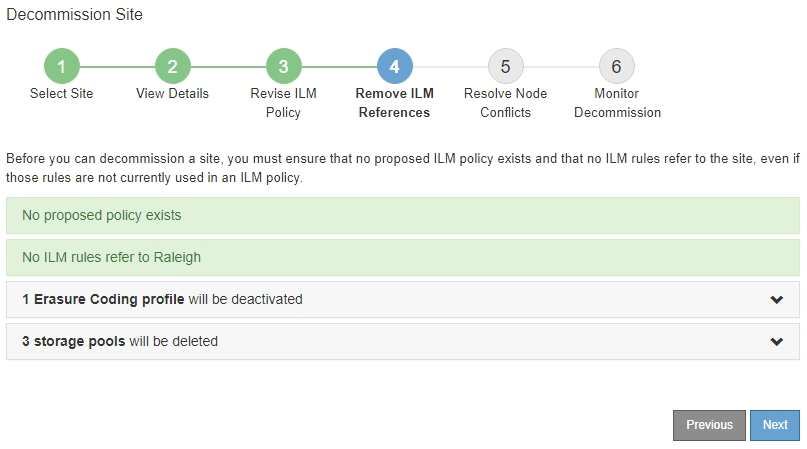

= 4단계: ILM 참조 제거
:allow-uri-read: 
:icons: font
:imagesdir: ../media/

[role="lead"]
서비스 해제 사이트 마법사의 4단계(ILM 참조 제거)에서 제안된 정책이 있는 경우 이를 제거하고 사이트를 참조하는 사용되지 않는 ILM 규칙을 삭제하거나 편집할 수 있습니다.

.이 작업에 대해
다음과 같은 경우 사이트 서비스 해제 절차를 시작할 수 없습니다.

* 제안된 ILM 정책이 있습니다. 제안된 정책이 있는 경우 삭제해야 합니다.
* ILM 규칙은 ILM 정책에 사용되지 않는 경우에도 사이트를 참조합니다. 사이트를 참조하는 모든 규칙을 삭제하거나 편집해야 합니다.

.단계
. 제안된 정책이 나열된 경우 해당 정책을 제거합니다.
+
.. 제안된 정책 삭제 * 를 선택합니다.
.. 확인 대화 상자에서 * 확인 * 을 선택합니다.

. 사용하지 않는 ILM 규칙이 사이트를 참조하는지 확인합니다.
+
image::../media/decommission_site_step_4_ilm_rules.png[사이트 서비스 해제 4단계 ILM 규칙]

+
나열된 모든 ILM 규칙은 여전히 사이트를 참조하지만 정책에 사용되지 않습니다. 예제:

+
** Make 2 Copies * 규칙은 * All Sites * 사이트를 사용하는 * All Storage Nodes * 스토리지 풀(StorageGRID 11.6 이하)을 사용합니다.
** S3 테넌트 * 의 사용되지 않은 * 3개 복사본은 * Raleigh * 스토리지 풀을 나타냅니다.
** 더 작은 객체를 위한 미사용 * 2 복제본 2 사이트는 * Raleigh * 스토리지 풀을 나타냅니다.
** 사용되지 않는 * EC 더 큰 오브젝트 * 규칙은 * All 3 Sites * 삭제 코딩 프로필의 Raleigh 사이트를 사용합니다.
** ILM 규칙이 나열되지 않으면 * 다음 * 을 선택하여 로 이동합니다 link:step-5-resolve-node-conflicts.html["5단계: 노드 충돌 해결(및 서비스 해제 시작)"].
+

NOTE: StorageGRID에서 사이트의 압축을 풀 경우 사이트를 참조하는 사용되지 않는 삭제 코딩 프로필이 자동으로 비활성화되고, 사이트를 참조하는 사용되지 않는 스토리지 풀이 자동으로 삭제됩니다. 모든 스토리지 노드 스토리지 풀(StorageGRID 11.6 이하)은 모든 사이트 사이트를 사용하므로 제거됩니다.

** 하나 이상의 ILM 규칙이 나열된 경우 다음 단계로 이동합니다.

. 사용하지 않는 각 규칙 편집 또는 삭제:
+
** 규칙을 편집하려면 ILM 규칙 페이지로 이동하여 해당 사이트를 참조하는 삭제 코딩 프로필 또는 스토리지 풀을 사용하는 모든 배치를 업데이트합니다. 그런 다음 * 4단계(ILM 참조 제거) * 로 돌아갑니다.
+

NOTE: 자세한 내용은 정보 수명 주기 관리를 사용하여 개체를 관리하는 지침을 참조하십시오.

** 규칙을 삭제하려면 휴지통 아이콘을 선택합니다 image:../media/icon_trash_can.png["아이콘 휴지통을 사용할 수 있습니다"] 를 선택하고 * 확인 * 을 선택합니다.
+

IMPORTANT: 사이트를 해제하려면 먼저 * 복사본 2개 만들기 * 규칙을 삭제해야 합니다.

. 제안된 ILM 정책이 존재하지 않는지, 사용되지 않는 ILM 규칙이 사이트를 참조하지 않는지, 그리고 * 다음 * 버튼이 활성화되어 있는지 확인합니다.
+

. 다음 * 을 선택합니다.
+

NOTE: 사이트를 제거하면 사이트를 참조하는 나머지 스토리지 풀 및 삭제 코딩 프로필이 무효화됩니다. StorageGRID에서 사이트의 압축을 풀 경우 사이트를 참조하는 사용되지 않는 삭제 코딩 프로필이 자동으로 비활성화되고, 사이트를 참조하는 사용되지 않는 스토리지 풀이 자동으로 삭제됩니다. 모든 스토리지 노드 스토리지 풀(StorageGRID 11.6 이하)은 모든 사이트 사이트를 사용하므로 제거됩니다.

+
5단계(노드 충돌 해결)가 나타납니다.

