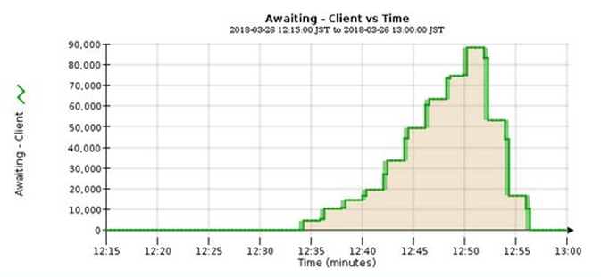

= 정보 수명 주기 관리를 모니터링합니다
:allow-uri-read: 
:icons: font
:imagesdir: ../media/

[role="lead"]
ILM(정보 수명 주기 관리) 시스템은 그리드에 저장된 모든 개체에 대한 데이터 관리 기능을 제공합니다. ILM 작업을 모니터링하여 그리드에서 현재 로드를 처리할 수 있는지 또는 더 많은 리소스가 필요한지 여부를 이해해야 합니다.

.이 작업에 대해
StorageGRID 시스템은 활성 ILM 정책을 적용하여 객체를 관리합니다. ILM 정책 및 관련 ILM 규칙은 복사되는 복사본 수, 생성되는 복사본 유형, 복사본 배치 위치 및 각 복사본이 유지되는 시간을 결정합니다.

오브젝트 수집 및 기타 오브젝트 관련 활동이 StorageGRID에서 ILM을 평가할 수 있는 속도를 초과할 수 있으므로 시스템에서 ILM 배치 지침을 거의 실시간으로 이행할 수 없는 개체를 대기열에 추가할 수 있습니다. Awaiting-Client 속성을 차트로 표시하여 StorageGRID가 클라이언트 작업을 지원하는지 여부를 모니터링할 수 있습니다.

이 속성을 차트로 작성하려면 다음과 같이 하십시오.

. Grid Manager에 로그인합니다.
. 대시보드에서 ILM(정보 수명 주기 관리) 탭에서 * Awaiting-Client * 항목을 찾습니다.
. 차트 아이콘을 클릭합니다 image:../media/icon_chart_new_for_11_5.png["차트 아이콘"].

이 예제 차트는 ILM 평가를 기다리는 개체 수가 일시적으로 지속 불가능한 방식으로 증가했다가 결국 감소하는 상황을 보여 줍니다. 이러한 경향은 ILM이 거의 실시간으로 임시 이행되지 않았음을 나타냅니다.

대기 중 - 클라이언트 차트에서 일시적인 스파이크가 예상됩니다. 하지만 차트에 표시된 값이 계속 증가하고 감소되지 않는 경우 그리드에서 효율적으로 작동하기 위해 더 많은 리소스가 필요합니다. 즉, 더 많은 스토리지 노드 또는 ILM 정책이 원격 위치에 개체를 배치하는 경우 더 많은 네트워크 대역폭 이 필요합니다.

nodes * 페이지를 사용하여 ILM 대기열을 추가로 조사할 수 있습니다.

.단계
. 노드 * 를 선택합니다.
. _GRID NAME_ * > * ILM * 을 선택합니다.
. ILM 대기열 그래프 위에 커서를 놓으면 지정된 시점에 다음 속성의 값을 볼 수 있습니다.
+
** * 대기 중인 오브젝트(클라이언트 작업에서) *: 클라이언트 작업(예: 수집)으로 인해 ILM 평가를 대기 중인 총 오브젝트 수
** * 대기 중인 개체(모든 작업에서) *: ILM 평가를 대기 중인 총 개체 수.
** * 스캔 속도(개체/초) *: 그리드의 개체가 스캔되어 ILM을 위해 대기 중인 속도입니다.
** * 평가 속도(개체/초) *: 그리드의 ILM 정책에 따라 개체를 평가하는 현재 속도입니다.

. ILM 대기열 섹션에서 다음 속성을 확인합니다.
+

NOTE: ILM 대기열 섹션은 그리드에만 포함됩니다. 이 정보는 사이트 또는 스토리지 노드의 ILM 탭에 표시되지 않습니다.

+
** * Scan Period - Estimated *(스캔 기간 - 추정 *): 모든 개체의 전체 ILM 스캔을 완료하는 데 걸리는 예상 시간입니다.
+

NOTE: 전체 스캔은 ILM이 모든 개체에 적용되었다고 보장하지 않습니다.

** * 복구 시도 *: 복제된 데이터에 대한 총 객체 복구 작업 수입니다. 이 수는 스토리지 노드가 고위험 객체를 복구하려고 할 때마다 증가합니다. 그리드가 사용 중인 경우 위험이 높은 ILM 수리의 우선 순위가 지정됩니다.
+

NOTE: 복구 후 복제에 실패한 경우 동일한 객체 복구가 다시 증가할 수 있습니다.

+
이러한 속성은 스토리지 노드 볼륨 복구 진행률을 모니터링할 때 유용할 수 있습니다. 시도된 수리 횟수가 증가하고 전체 스캔이 완료된 경우 수리가 완료된 것일 수 있습니다.

