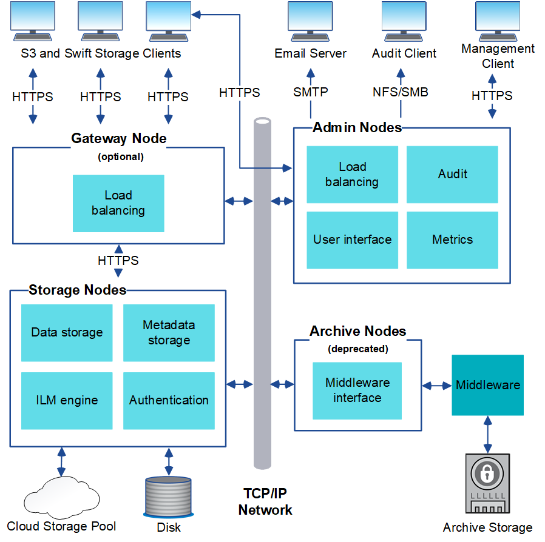

= StorageGRID 아키텍처 및 네트워크 토폴로지
:allow-uri-read: 
:icons: font
:imagesdir: ../media/

[role="lead"]
StorageGRID 시스템은 하나 이상의 데이터 센터 사이트에 있는 여러 유형의 그리드 노드로 구성됩니다.

StorageGRID 네트워크 토폴로지, 요구 사항 및 그리드 통신에 대한 자세한 내용은 를 참조하십시오 link:../network/index.html["네트워킹 지침"].

== 구축 토폴로지

StorageGRID 시스템은 단일 데이터 센터 사이트 또는 여러 데이터 센터 사이트에 구축할 수 있습니다.

=== 단일 사이트

단일 사이트를 통한 배포에서는 StorageGRID 시스템의 인프라 및 운영이 중앙 집중화됩니다.

image::../media/data_center_site_single.png[단일 데이터 센터 사이트]

=== 여러 사이트

사이트가 여러 개인 배포에서는 각 사이트에 다양한 유형과 개수의 StorageGRID 리소스를 설치할 수 있습니다. 예를 들어, 한 데이터 센터에 다른 데이터 센터보다 더 많은 스토리지가 필요할 수 있습니다.

지진에 장애가 있거나 홍수 범람장과 같이 서로 다른 장애 도메인에 있는 서로 다른 지역에 여러 사이트가 있는 경우가 많습니다. 데이터를 다른 사이트에 자동으로 배포하면 데이터 공유 및 재해 복구가 가능합니다.

image::../media/data_center_sites_multiple.png[다중 데이터 센터 사이트]

또한 단일 데이터 센터 내에 여러 개의 논리적 사이트가 존재하여 분산된 복제 및 삭제 코딩을 통해 가용성과 복원력을 높일 수 있습니다.

=== 그리드 노드 이중화

단일 사이트 또는 다중 사이트 배포에서는 이중화를 위해 선택적으로 여러 관리 노드 또는 게이트웨이 노드를 포함할 수 있습니다. 예를 들어, 단일 사이트나 여러 사이트에 둘 이상의 관리 노드를 설치할 수 있습니다. 그러나 각 StorageGRID 시스템에는 하나의 기본 관리 노드만 있을 수 있습니다.

== 시스템 아키텍처

이 다이어그램은 StorageGRID 시스템 내에서 그리드 노드를 배열하는 방법을 보여 줍니다.

S3 및 Swift 클라이언트는 StorageGRID에 오브젝트를 저장하고 검색합니다. 다른 클라이언트는 e-메일 알림을 보내고, StorageGRID 관리 인터페이스에 액세스하고, 선택적으로 감사 공유에 액세스하는 데 사용됩니다.

S3 및 Swift 클라이언트는 게이트웨이 노드 또는 관리 노드에 연결하여 스토리지 노드에 대한 로드 밸런싱 인터페이스를 사용할 수 있습니다. 또는 S3 및 Swift 클라이언트가 HTTPS를 사용하여 스토리지 노드에 직접 연결할 수 있습니다.

오브젝트를 소프트웨어 또는 하드웨어 기반 스토리지 노드의 StorageGRID 내에 저장하거나 외부 S3 버킷 또는 Azure Blob 스토리지 컨테이너로 구성된 클라우드 스토리지 풀에 저장할 수 있습니다.

== 그리드 노드 및 서비스

StorageGRID 시스템의 기본 구성 요소는 그리드 노드입니다. 노드에는 그리드 노드에 일련의 기능을 제공하는 소프트웨어 모듈인 서비스가 포함됩니다.

StorageGRID 시스템은 네 가지 유형의 그리드 노드를 사용합니다.

* * 관리 노드 * 는 시스템 구성, 모니터링 및 로깅과 같은 관리 서비스를 제공합니다. Grid Manager에 로그인하면 관리 노드에 연결됩니다. 각 그리드에는 1개의 기본 관리 노드가 있어야 하며 이중화를 위해 추가적인 비 기본 관리 노드가 있을 수 있습니다. 모든 관리 노드에 연결할 수 있으며 각 관리 노드에는 StorageGRID 시스템의 유사한 보기가 표시됩니다. 그러나 기본 관리 노드를 사용하여 유지 관리 절차를 수행해야 합니다.
+
관리 노드를 사용하여 S3 및 Swift 클라이언트 트래픽의 로드 밸런싱을 수행할 수도 있습니다.

* * 스토리지 노드 * 는 오브젝트 데이터와 메타데이터를 관리하고 저장합니다. 각 StorageGRID 시스템에는 3개 이상의 스토리지 노드가 있어야 합니다. 여러 사이트가 있는 경우 StorageGRID 시스템 내의 각 사이트에도 3개의 스토리지 노드가 있어야 합니다.
* * 게이트웨이 노드(선택 사항) * 클라이언트 응용 프로그램이 StorageGRID에 연결하는 데 사용할 수 있는 로드 밸런싱 인터페이스를 제공합니다. 로드 밸런서는 클라이언트를 최적의 스토리지 노드로 원활하게 전달하여 노드 장애나 전체 사이트에 대한 투명성이 확보되도록 합니다. 로드 밸런싱에 게이트웨이 노드와 관리 노드 조합을 사용하거나 타사 HTTP 로드 밸런서를 구현할 수 있습니다.
* * 아카이브 노드(사용되지 않음) * 는 객체 데이터를 테이프에 아카이빙하는 데 사용할 수 있는 선택적 인터페이스를 제공합니다.

자세한 내용은 을 참조하십시오 link:../admin/index.html["StorageGRID 관리"].

=== 소프트웨어 기반 노드

소프트웨어 기반 그리드 노드는 다음과 같은 방법으로 구축할 수 있습니다.

* VMware vSphere에서 VM(가상 머신)으로 사용됩니다
* Linux 호스트의 컨테이너 엔진 내 지원되는 운영 체제는 다음과 같습니다.
+
** Red Hat Enterprise Linux
** CentOS
** 우분투
** 데비안

자세한 내용은 다음을 참조하십시오.

* link:../vmware/index.html["VMware를 설치합니다"]
* link:../rhel/index.html["Red Hat Enterprise Linux 또는 CentOS를 설치합니다"]
* link:../ubuntu/index.html["Ubuntu 또는 Debian을 설치합니다"]

를 사용합니다 https://["NetApp 상호 운용성 매트릭스 툴(IMT)"^] 를 클릭하여 지원되는 버전 목록을 가져옵니다.

=== StorageGRID 어플라이언스 노드

StorageGRID 하드웨어 어플라이언스는 StorageGRID 시스템에서 사용하도록 특별히 설계되었습니다. 일부 어플라이언스는 스토리지 노드로 사용할 수 있습니다. 다른 어플라이언스를 관리 노드 또는 게이트웨이 노드로 사용할 수 있습니다. 어플라이언스 노드를 소프트웨어 기반 노드와 결합하거나, 외부 하이퍼바이저, 스토리지 또는 컴퓨팅 하드웨어에 종속되지 않는 완전히 엔지니어링된 모든 어플라이언스 그리드를 구축할 수 있습니다.

다음과 같은 유형의 StorageGRID 어플라이언스를 사용할 수 있습니다.

* SGF6112 스토리지 어플라이언스 * 는 컴퓨팅 및 스토리지 컨트롤러가 통합된 12개의 NVMe(비휘발성 메모리 익스프레스) SSD 드라이브를 갖춘 All-Flash 1U(1-Rack-Unit) 서버입니다.
* SG100 및 SG1000 서비스 어플라이언스 * 는 각각 기본 관리 노드, 비기본 관리 노드 또는 게이트웨이 노드로 작동할 수 있는 1랙 유닛(1U) 서버입니다. 두 어플라이언스 모두 게이트웨이 노드와 관리 노드(운영 및 비운영)로 동시에 작동할 수 있습니다.
* SG6000 스토리지 어플라이언스 * 는 스토리지 노드로 작동하며 1U SG6000-CN 컴퓨팅 컨트롤러를 2U 또는 4U 스토리지 컨트롤러 쉘프와 결합합니다. SG6000은 두 가지 모델로 제공됩니다.
+
** * SGF6024 *: SG6000-CN 컴퓨팅 컨트롤러를 24개의 SSD(Solid State Drive) 및 이중 스토리지 컨트롤러가 포함된 2U 스토리지 컨트롤러 쉘프와 결합합니다.
** * SG6060 *: SG6000-CN 컴퓨팅 컨트롤러를 58개의 NL-SAS 드라이브, 2개의 SSD 및 이중 스토리지 컨트롤러가 포함된 4U 엔클로저와 결합합니다. 각 SG6060 어플라이언스는 1개 또는 2개의 60 드라이브 확장 쉘프를 지원하며 오브젝트 스토리지 전용 드라이브를 최대 178개까지 제공합니다.

* SG5700 스토리지 어플라이언스 * 는 스토리지 노드로 작동하는 통합 스토리지 및 컴퓨팅 플랫폼입니다. SG5700은 다음 두 가지 모델로 제공됩니다.
+
** * SG5712 *: 12개의 NL-SAS 드라이브와 통합 스토리지 및 컴퓨팅 컨트롤러를 포함하는 2U 엔클로저
** * SG5760 *: NL-SAS 드라이브 60개와 통합 스토리지 및 컴퓨팅 컨트롤러를 포함하는 4U 엔클로저

자세한 내용은 다음을 참조하십시오.

* https://["NetApp Hardware Universe를 참조하십시오"^]
* link:../installconfig/hardware-description-sg6100.html["SGF6112 스토리지 어플라이언스"]
* link:../installconfig/hardware-description-sg100-and-1000.html["SG100 및 SG1000 서비스 어플라이언스"]
* link:../installconfig/hardware-description-sg6000.html["SG6000 스토리지 어플라이언스"]
* link:../installconfig/hardware-description-sg5700.html["SG5700 스토리지 어플라이언스"]

=== 관리 노드에 대한 기본 서비스

다음 표에서는 관리 노드의 기본 서비스를 보여 줍니다. 그러나 이 테이블에는 모든 노드 서비스가 나열되지는 않습니다.

[cols="1a,2a"]
|===
| 서비스 | 키 기능 

 a| 
AMS(감사 관리 시스템)
 a| 
시스템 활동 및 이벤트를 추적합니다.

 a| 
구성 관리 노드(CMN)
 a| 
시스템 전체 구성을 관리합니다. 기본 관리자 노드만.

 a| 
관리 애플리케이션 프로그램 인터페이스(관리 API)
 a| 
Grid Management API 및 Tenant Management API의 요청을 처리합니다.

 a| 
고가용성
 a| 
관리 노드 및 게이트웨이 노드 그룹의 고가용성 가상 IP 주소를 관리합니다.

* 참고: * 이 서비스는 게이트웨이 노드에서도 찾을 수 있습니다.

 a| 
로드 밸런서
 a| 
클라이언트에서 스토리지 노드로 S3 및 Swift 트래픽의 로드 밸런싱을 제공합니다.

* 참고: * 이 서비스는 게이트웨이 노드에서도 찾을 수 있습니다.

 a| 
네트워크 관리 시스템(NMS)
 a| 
그리드 관리자를 위한 기능을 제공합니다.

 a| 
프로메테우스
 a| 
모든 노드의 서비스에서 시계열 메트릭을 수집 및 저장합니다.

 a| 
서버 상태 모니터(SSM)
 a| 
운영 체제 및 기본 하드웨어를 모니터링합니다.

|===

=== 스토리지 노드의 기본 서비스

다음 표에는 스토리지 노드의 기본 서비스가 나와 있지만 이 표에는 모든 노드 서비스가 나와 있지 않습니다.

NOTE: ADC 서비스 및 RSM 서비스와 같은 일부 서비스는 일반적으로 각 사이트의 세 스토리지 노드에만 존재합니다.

[cols="1a,2a"]
|===
| 서비스 | 키 기능 

 a| 
계정(acct)
 a| 
테넌트 계정을 관리합니다.

 a| 
관리 도메인 컨트롤러(ADC)
 a| 
토폴로지 및 그리드 전체의 구성 유지

 a| 
Cassandra 를 클릭합니다
 a| 
오브젝트 메타데이터를 저장하고 보호합니다.

 a| 
Cassandra Refaper(Cassandra 성형기)
 a| 
오브젝트 메타데이터를 자동으로 복구합니다.

 a| 
청크
 a| 
삭제 코딩 데이터 및 패리티 조각을 관리합니다.

 a| 
Data Mover(DMV)
 a| 
데이터를 클라우드 스토리지 풀로 이동합니다.

 a| 
DDS(분산 데이터 저장소)
 a| 
오브젝트 메타데이터 스토리지를 모니터링합니다.

 a| 
ID(idnt)
 a| 
LDAP 및 Active Directory에서 사용자 ID를 페더레이션합니다.

 a| 
LDR(Local Distribution Router)
 a| 
오브젝트 스토리지 프로토콜 요청을 처리하고 디스크의 오브젝트 데이터를 관리합니다.

 a| 
복제된 상태 시스템(RSM)
 a| 
S3 플랫폼 서비스 요청이 해당 엔드포인트로 전송되도록 합니다.

 a| 
서버 상태 모니터(SSM)
 a| 
운영 체제 및 기본 하드웨어를 모니터링합니다.

|===

=== 게이트웨이 노드에 대한 기본 서비스

다음 표에서는 게이트웨이 노드의 기본 서비스를 보여 줍니다. 그러나 이 테이블에는 모든 노드 서비스가 나열되지는 않습니다.

[cols="1a,2a"]
|===
| 서비스 | 키 기능 

 a| 
고가용성
 a| 
관리 노드 및 게이트웨이 노드 그룹의 고가용성 가상 IP 주소를 관리합니다.

* 참고: * 이 서비스는 관리 노드에서도 찾을 수 있습니다.

 a| 
로드 밸런서
 a| 
클라이언트에서 스토리지 노드로 S3 및 Swift 트래픽의 계층 7 로드 밸런싱을 제공합니다. 이것은 권장되는 로드 밸런싱 메커니즘입니다.

* 참고: * 이 서비스는 관리 노드에서도 찾을 수 있습니다.

 a| 
서버 상태 모니터(SSM)
 a| 
운영 체제 및 기본 하드웨어를 모니터링합니다.

|===

=== 아카이브 노드에 대한 기본 서비스

다음 표에는 아카이브 노드의 기본 서비스(현재 사용되지 않음)가 나와 있지만 이 표에는 모든 노드 서비스가 나열되어 있지 않습니다.

NOTE: 아카이브 노드에 대한 지원은 더 이상 사용되지 않으며 향후 릴리즈에서 제거될 예정입니다.

[cols="1a,2a"]
|===
| 서비스 | 키 기능 

 a| 
아카이브(ARC)
 a| 
TSM(Tivoli Storage Manager) 외부 테이프 스토리지 시스템과 통신합니다.

 a| 
서버 상태 모니터(SSM)
 a| 
운영 체제 및 기본 하드웨어를 모니터링합니다.

|===

=== StorageGRID 서비스

다음은 StorageGRID 서비스의 전체 목록입니다.

* * 계정 서비스 전달자*
+
로드 밸런서 서비스가 원격 호스트에서 계정 서비스를 쿼리하도록 하는 인터페이스를 제공하고 로드 밸런서 끝점 구성 변경 사항을 로드 밸런서 서비스에 알려 줍니다. 로드 밸런서 서비스는 관리 노드 및 게이트웨이 노드에 있습니다.

* * ADC 서비스(관리 도메인 컨트롤러) *
+
LDR 및 CMN 서비스의 토폴로지 정보 유지, 인증 서비스 제공 및 쿼리에 응답 ADC 서비스는 사이트에 설치된 처음 세 개의 스토리지 노드 각각에 제공됩니다.

* * AMS 서비스(감사 관리 시스템) *
+
감사된 모든 시스템 이벤트 및 트랜잭션을 모니터링하고 텍스트 로그 파일에 기록합니다. AMS 서비스가 관리 노드에 있습니다.

* * ARC 서비스(보관) *
+
TSM 미들웨어를 통해 S3 인터페이스 또는 테이프를 통해 클라우드와 같은 외부 아카이브 스토리지에 대한 연결을 구성하는 관리 인터페이스를 제공합니다. ARC 서비스는 아카이브 노드에 있습니다.

* * Cassandra Refaper 서비스 *
+
오브젝트 메타데이터를 자동으로 복구합니다. Cassandra Refaper 서비스는 모든 스토리지 노드에 있습니다.

* * 청크 서비스 *
+
삭제 코딩 데이터 및 패리티 조각을 관리합니다. 스토리지 노드에 청크 서비스가 있습니다.

* * CMN 서비스(구성 관리 노드) *
+
시스템 전체 구성 및 그리드 작업 관리 각 그리드에는 기본 관리 노드에 있는 하나의 CMN 서비스가 있습니다.

* * DDS 서비스(분산 데이터 저장소) *
+
Cassandra 데이터베이스와 연결되어 개체 메타데이터를 관리합니다. DDS 서비스는 스토리지 노드에 있습니다.

* * DMV 서비스(Data Mover) *
+
데이터를 클라우드 엔드포인트로 이동합니다. DMV 서비스가 스토리지 노드에 있습니다.

* * 동적 IP 서비스 *
+
그리드를 모니터링하여 동적 IP 변경 사항을 모니터링하고 로컬 구성을 업데이트합니다. 동적 IP(dynip) 서비스가 모든 노드에 존재합니다.

* * Grafana 서비스 *
+
Grid Manager에서 메트릭 시각화에 사용됩니다. Grafana 서비스가 관리 노드에 존재합니다.

* * 고가용성 서비스 *
+
High Availability Groups 페이지에 구성된 노드의 고가용성 가상 IP를 관리합니다. 고가용성 서비스는 관리 노드 및 게이트웨이 노드에 있습니다. 이 서비스는 Keeepalived 서비스라고도 합니다.

* * ID(idnt) 서비스 *
+
LDAP 및 Active Directory에서 사용자 ID를 페더레이션합니다. ID 서비스(idnt)는 각 사이트의 세 스토리지 노드에 있습니다.

* * 람다 중재인 서비스 *
+
S3 Select SelectObjectContent 요청을 관리합니다.

* * 로드 밸런서 서비스 *
+
클라이언트에서 스토리지 노드로 S3 및 Swift 트래픽의 로드 밸런싱을 제공합니다. 부하 분산 서비스는 부하 분산 엔드포인트 구성 페이지를 통해 구성할 수 있습니다. 로드 밸런서 서비스는 관리 노드 및 게이트웨이 노드에 있습니다. 이 서비스는 nginx-GW 서비스라고도 합니다.

* * LDR 서비스(Local Distribution Router) *
+
그리드 내의 컨텐츠 저장 및 전송을 관리합니다. LDR 서비스가 스토리지 노드에 있습니다.

* * MISCd 정보 서비스 제어 데몬 서비스 *
+
다른 노드의 서비스를 쿼리 및 관리하고 다른 노드에서 실행 중인 서비스 상태를 쿼리하는 것과 같은 노드의 환경 구성을 관리하기 위한 인터페이스를 제공합니다. MISCd 서비스가 모든 노드에 있습니다.

* * nginx 서비스 *
+
HTTPS API를 통해 다른 노드의 서비스와 통신할 수 있도록 다양한 그리드 서비스(예: Prometheus 및 Dynamic IP)를 위한 인증 및 보안 통신 메커니즘 역할을 합니다. nginx 서비스는 모든 노드에 있습니다.

* * nginx-GW 서비스 *
+
로드 밸런서 서비스에 전원을 공급합니다. Nginx-GW 서비스는 관리 노드 및 게이트웨이 노드에 있습니다.

* * NMS 서비스(네트워크 관리 시스템) *
+
Grid Manager를 통해 표시되는 모니터링, 보고 및 구성 옵션을 강화합니다. NMS 서비스가 관리 노드에 있습니다.

* * 지속성 서비스 *
+
재부팅 시 유지되어야 하는 루트 디스크의 파일을 관리합니다. Persistence 서비스는 모든 노드에 있습니다.

* * Prometheus 서비스 *
+
모든 노드의 서비스에서 시계열 메트릭을 수집합니다. Prometheus 서비스는 관리 노드에 있습니다.

* RSM 서비스(복제된 상태 기계 서비스) *
+
플랫폼 서비스 요청이 각 엔드포인트로 전송되도록 합니다. RSM 서비스는 ADC 서비스를 사용하는 스토리지 노드에 있습니다.

* * SSM 서비스(서버 상태 모니터) *
+
하드웨어 조건을 모니터링하고 NMS 서비스에 보고합니다. SSM 서비스의 인스턴스는 모든 그리드 노드에 존재합니다.

* * 추적 수집기 서비스 *
+
기술 지원 부서에서 사용할 정보를 수집하기 위해 추적 수집을 수행합니다. 추적 수집기 서비스는 오픈 소스 Jaeger 소프트웨어를 사용하며 관리 노드에 있습니다.

